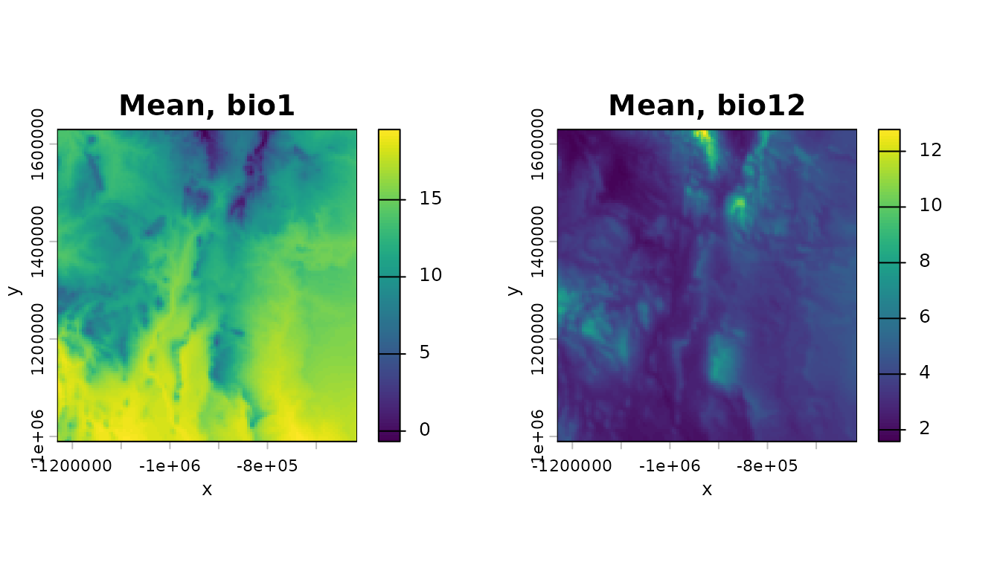
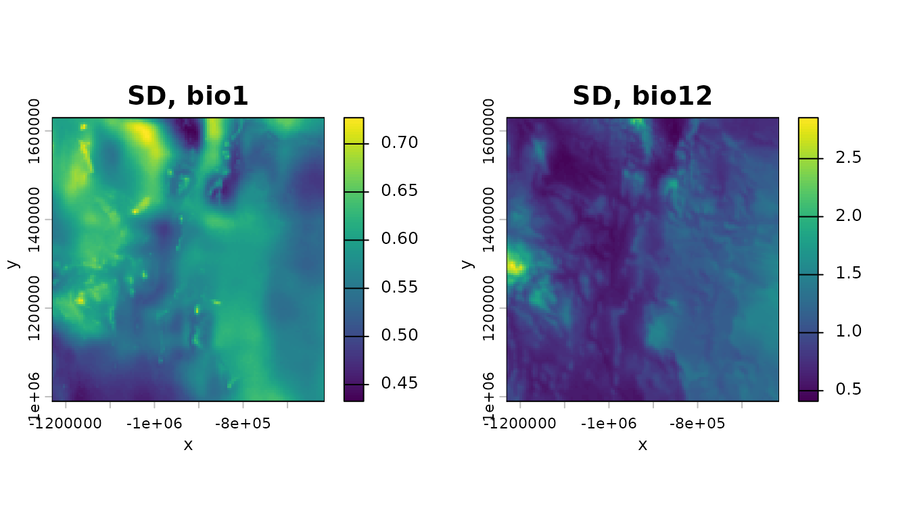
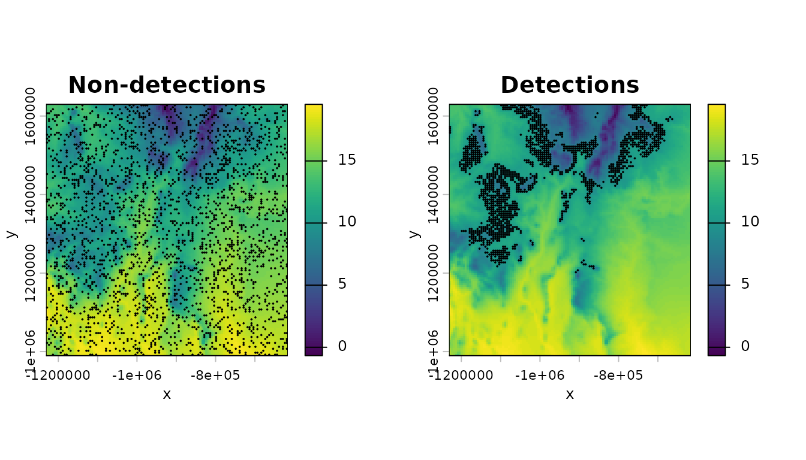
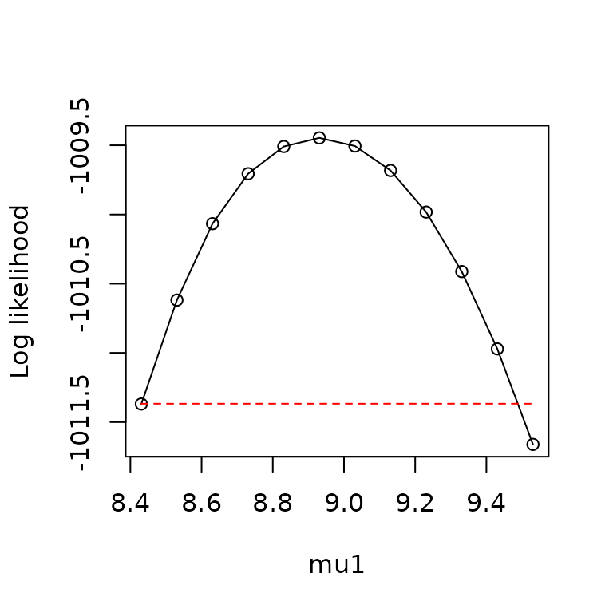
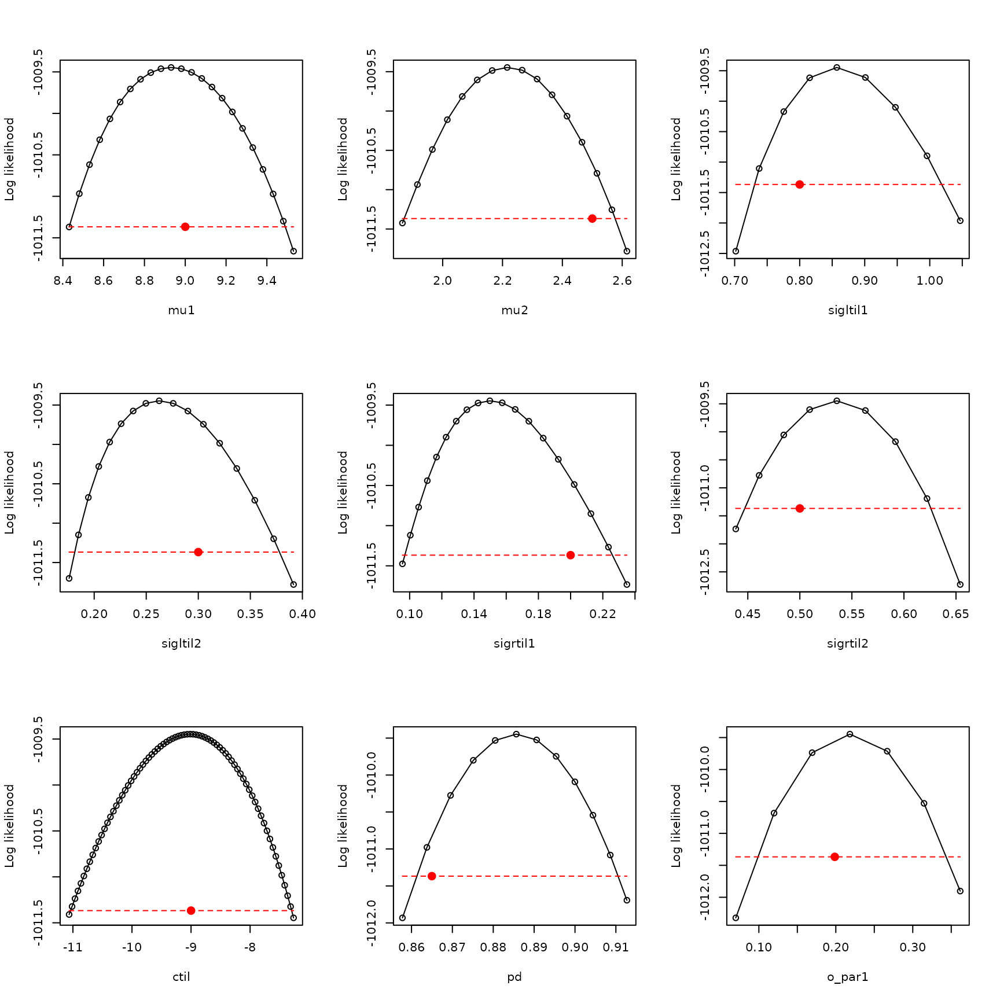
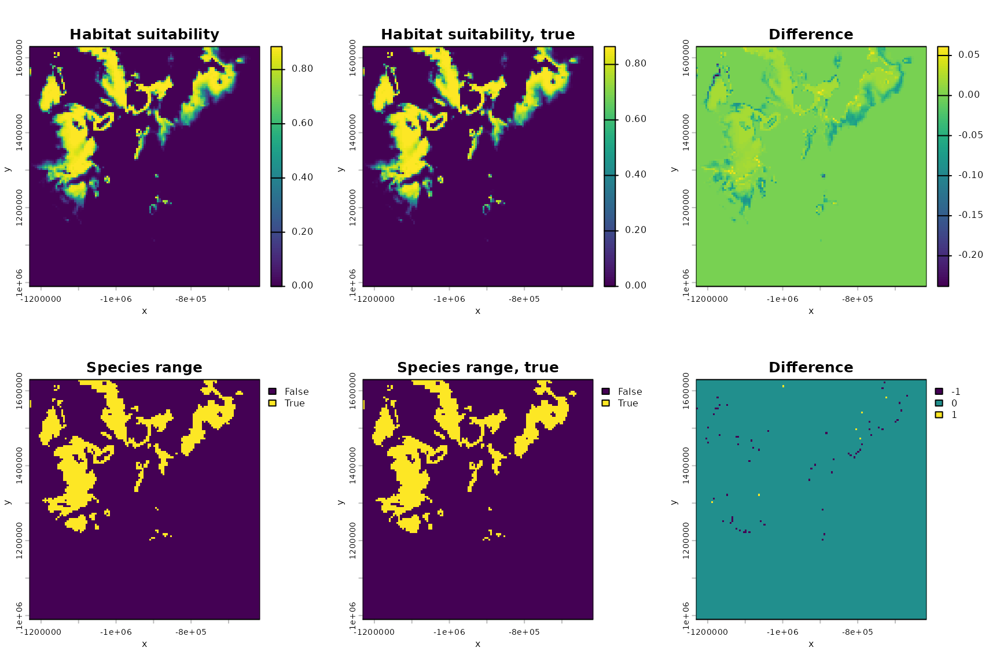
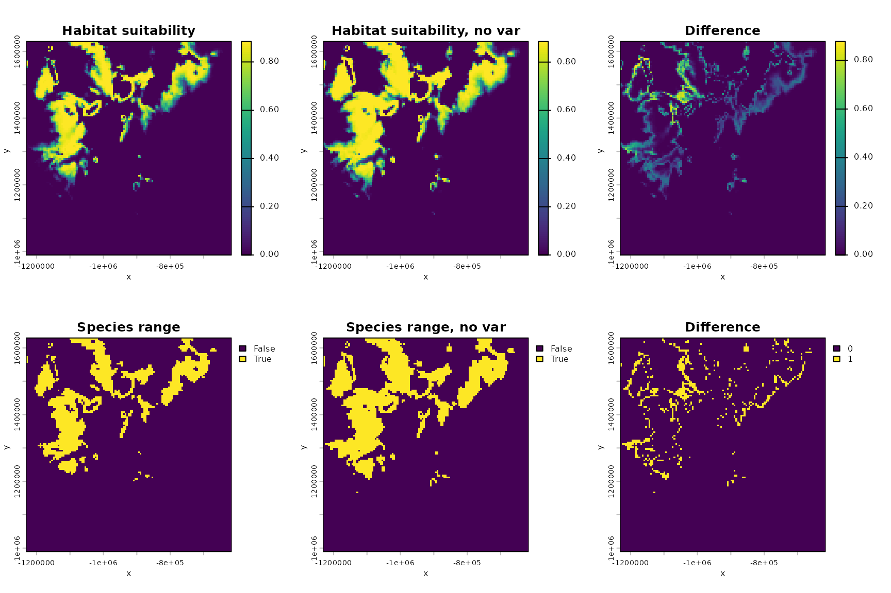
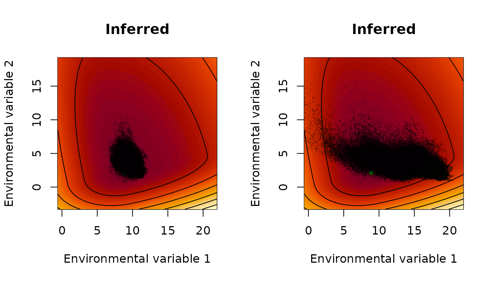
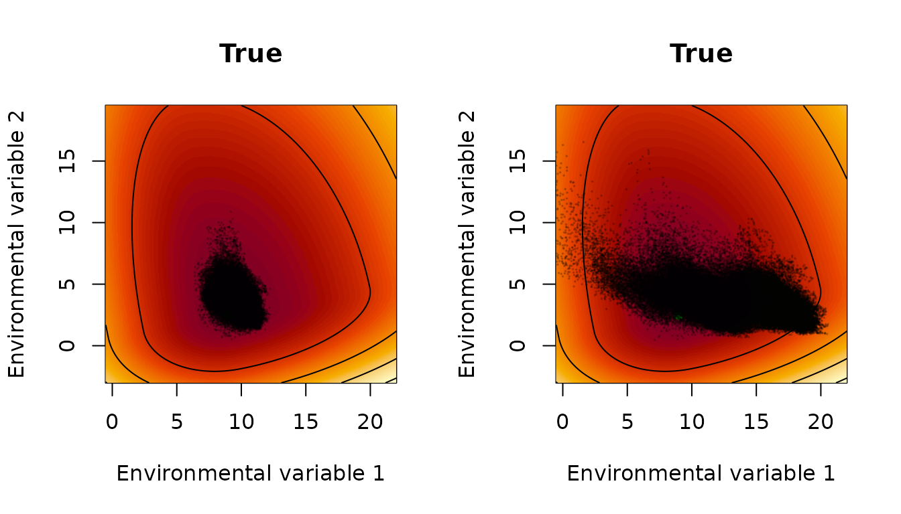

# How to fit xsdm models with species occurrence data using xsdm

\\ \newcommand{\mean}\[1\]{\overline{#1}} \newcommand{\var}{\text{var}}
\newcommand{\cov}{\text{cov}} \newcommand{\cor}{\text{cor}}
\newcommand{\Rp}{\text{Re}} \newcommand{\E}{\text{E}}
\newcommand{\ltsgr}{\text{ltsgr}} \newcommand{\expit}{\text{expit}}
\newcommand{\logit}{\text{logit}} \\

**Abstract.** After reading the document entitled “The xsdm model”, this
document introduces the statistically and computationally sophisticated
user to the main functions of the `xsdm` package. The package implements
a frequentist analysis of the xsdm model. This document should get the
user to the point of maximizing the likelihood of the model and
profiling in “easy” cases, with callouts to several troubleshooting
documents about what to do when the process does not go smoothly.
Alternative fitted models can also be compared by AIC or another
criterion. The example worked out here is for a virtual species (i.e.,
generated data), so we also demonstrate that fitting an xsdm model can
recover the true parameters if model mis-specification is not an issue.

## Introduction to the running example used throughout this document

This manual uses a small built-in example included with the `xsdm` R
package to illustrate a baseline workflow. The example contains (i) an
occurrence table for a virtual species, and (ii) two environmental
`terra` raster time series representing CHELSA-derived bioclimatic
variables for a region of interest over 39 years.

Load the data and get oriented to the first bioclimatic variable, which
is mean annual temperature in units of \\100 \times ^\circ\\C for 39
years for a particular region of interest. And make it units of
\\^\circ\\C:

``` r

library(xsdm)

bio_1 <- terra::unwrap(example_1$bio01)
class(bio_1)
```

    ## [1] "SpatRaster"
    ## attr(,"package")
    ## [1] "terra"

``` r

dim(bio_1)
```

    ## [1] 128 123  39

``` r

mm <- terra::global(bio_1,fun=c("min","max"))
min(mm$min) #global min over all years and all locations
```

    ## [1] -154

``` r

max(mm$max) #global max
```

    ## [1] 2061

``` r

bio_1 <- bio_1/100 #Make it degrees C
```

Now load the second environmental variable, which is annual total
precipitation, in units of kg/m\\^2\\, for the same 39 years and the
same region of interest:

``` r

bio_12 <- terra::unwrap(example_1$bio12)
class(bio_12)
```

    ## [1] "SpatRaster"
    ## attr(,"package")
    ## [1] "terra"

``` r

dim(bio_12)
```

    ## [1] 128 123  39

``` r

mm <- terra::global(bio_12,fun=c("min","max"))
min(mm$min) #again the global min, all years and locations
```

    ## [1] 45

``` r

max(mm$max) #global max
```

    ## [1] 1761

If the scales of your environmental variables are vastly different, it
can cause problems with optimization (see the document “Troubleshooting:
Optimization problems related to scaling”). So we change the units for
precipitation to make the range of values similar to those for
temperature. Now the units are going to be dg/m\\^2\\:

``` r

bio_12 <- bio_12/100
mm <- terra::global(bio_1,fun=c("min","max"))
min(mm$min)
```

    ## [1] -1.54

``` r

max(mm$max)
```

    ## [1] 20.61

``` r

mm <- terra::global(bio_12,fun=c("min","max"))
min(mm$min)
```

    ## [1] 0.45

``` r

max(mm$max)
```

    ## [1] 17.61

Next load data on detections and non-detections/pseudo-absences for a
species:

``` r

d <- example_1$occ_df
class(d)
```

    ## [1] "tbl_df"     "tbl"        "data.frame"

``` r

dim(d)
```

    ## [1] 4000    4

``` r

head(d)
```

    ##                name      lon     lat presence
    ## 1 Species virtualis -1108723 1402222        1
    ## 2 Species virtualis  -883723 1402222        0
    ## 3 Species virtualis  -808723 1422222        1
    ## 4 Species virtualis -1168723 1552222        0
    ## 5 Species virtualis -1028723 1437222        0
    ## 6 Species virtualis  -948723 1452222        1

``` r

sum(d$presence==1)
```

    ## [1] 1609

Now take a basic look at the environmental variables and the species
data, just to see what we have. Start by getting the means through time
of the environmental time series and plotting:

``` r

m_bio_1 <- terra::app(bio_1,mean)
m_bio_12 <- terra::app(bio_12,mean)
par(mfrow=c(1,2))
terra::plot(m_bio_1,axes=TRUE,main="Mean, bio1",xlab="x",ylab="y",legend=TRUE)
terra::plot(m_bio_12,axes=TRUE,main="Mean, bio12",xlab="x",ylab="y",legend=TRUE)
```



Now do the same for standard deviations:

``` r

sd_bio_1 <- terra::app(bio_1,sd)
sd_bio_12 <- terra::app(bio_12,sd)
par(mfrow=c(1,2))
terra::plot(sd_bio_1,axes=TRUE,main="SD, bio1",xlab="x",ylab="y",legend=TRUE)
terra::plot(sd_bio_12,axes=TRUE,main="SD, bio12",xlab="x",ylab="y",legend=TRUE)
```



Now plot the species detections and non-detections/pseudo-absences on a
backdrop of the mean of bio 1:

``` r

pts_0 <- terra::vect(as.data.frame(d[d$presence==0,]),geom=c("lon","lat"),crs=terra::crs(m_bio_1))
pts_1 <- terra::vect(as.data.frame(d[d$presence==1,]),geom=c("lon","lat"),crs=terra::crs(m_bio_1))
par(mfrow=c(1,2))
terra::plot(m_bio_1,axes=TRUE,main="Non-detections",xlab="x",ylab="y",legend=TRUE)
terra::plot(pts_0,add=TRUE,col="black",pch=20,cex=.2)
terra::plot(m_bio_1,axes=TRUE,main="Detections",xlab="x",ylab="y",legend=TRUE)
terra::plot(pts_1,add=TRUE,col="black",pch=20,cex=.2)
```



The fitting tools offered by `xsdm` use a more succinct version of the
data, since only the environmental time series at the locations for
which there is a detection or a non-detection/pseudo-absence matter;
though we will return to using rasters after fitting and model
selection. So, for now, we cut out only those time series at the species
locations and store them in an array using the convenience function
[`env_data_array()`](https://xsdm-project.github.io/xsdm-devel/reference/env_data_array.md):

``` r

env_data <- list(bio_1=bio_1, bio_12=bio_12)  # order defines variable 1 and 2
env_array <- env_data_array(env_data, d)  # (n locations) x (time) x (p vars)
class(env_array)
```

    ## [1] "array"

``` r

dim(env_array)
```

    ## [1] 4000   39    2

And we pull out the presences/pseudo-absences as a binary vector:

``` r

occ <- d$presence
length(occ)
```

    ## [1] 4000

Now we are ready to think about how the xsdm model applies to our data.

## Evaluating the likelihood

The xsdm model’s likelihood function is described in the document “The
xsdm model”, where model parameter are also described in detail.
Parameters are:

- \\\vec{\mu}\\, which encodes ideal values for population growth of the
  two environmental variables (a length-2 vector for the present
  scenario of two environmental variables, unconstrained values);
- \\\tilde{\vec{\sigma}}\_L\\, which has to do with breadth of the
  growth-environment function “to the left” with respect to two basis
  vectors (a length-2 vector for our case, positive entries);
- \\\tilde{\vec{\sigma}}\_R\\, which is similar but “to the right” (a
  length-2 vector, positive entries);
- \\\tilde{c}\\ and \\p_d\\, which relate to species detection (scalars,
  \\\tilde{c}\\ is unconstrained and \\0\<p_d\leq 1\\); and
- \\O\\, which is an orthogonal matrix which describes the basis vectors
  mentioned above (\\2 \times 2\\ for the present example, must be
  orthogonal, i.e., \\OO^{\tau}=I\\ for \\\tau\\ the transpose).

In code, the above parameters are denoted `mu`, `sigltil`, `sigrtil`,
`ctil`, `pd`, and `o_mat`.

The likelihood is coded as
[`loglik_bio()`](https://xsdm-project.github.io/xsdm-devel/reference/loglik_bio.md),
so as an introduction to the function let’s evaluate it at a haphazardly
chosen set of parameters:

``` r

mu <- c(1,1)
sigltil <- c(1,4)
sigrtil <- c(2,3)
ctil <- -10
pd <- 0.8
o_mat <- diag(2)
loglik_bio(env_array,occ,mu,sigltil,sigrtil,o_mat=o_mat,ctil=ctil,pd=pd)
```

    ## [1] -2110.297

By default, the function gives the log likelihood, but you can also get
the linear-scale likelihood:

``` r

loglik_bio(env_array,occ,mu,sigltil,sigrtil,o_mat=o_mat,ctil=ctil,pd=pd,return_prob=TRUE)
```

    ## [1] 0

For these haphazardly chosen parameters, the (linear-scale) likelihood
is zero to within numeric precision - this is typical. We next optimize.

## An unconstrained parameter space

Some model parameters are constrained, i.e., only certain values are
allowed (specifically, `sigltil`, `sigrtil`, `pd`, and `o_mat`; see
previous section). Rather than attempt to perform optimizations subject
to these constraints, we here define a transformation from an
unconstrained Euclidean space to the space of allowed parameters, and we
subsequently optimize on the unconstrained space. Parameters in the
unconstrained space are henceforth called “math-scale” parameters, and
the constrained parameters described above are called “biological-scale”
parameters because they more directly represent biological quantities.
When a distinction is needed in mathematical notation, we denote
biological-scale parameters with a superscript \\(b)\\, and math-scale
parameters with a superscript \\(m)\\, i.e., \\\vec{\mu}^{(b)}\\,
\\O^{(b)}\\, \\\tilde{\vec{\sigma}}\_L^{(b)}\\,
\\\tilde{\vec{\sigma}}\_R^{(b)}\\, \\\tilde{c}^{(b)}\\, and
\\p_d^{(b)}\\ versus \\\vec{\mu}^{(m)}\\, \\O^{(m)}\\,
\\\tilde{\vec{\sigma}}\_L^{(m)}\\, \\\tilde{\vec{\sigma}}\_R^{(m)}\\,
\\\tilde{c}^{(m)}\\, and \\p_d^{(m)}\\.

The transformation from math- to biological-scale parameters acts
separately on each parameter, as follows for all the parameters except
\\O\\:

\\ \begin{aligned} \vec{\mu}^{(b)} &= \vec{\mu}^{(m)} \\
\tilde{\vec{\sigma}}\_L^{(b)} &= \exp(\tilde{\vec{\sigma}}\_L^{(m)}) \\
\tilde{\vec{\sigma}}\_R^{(b)} &= \exp(\tilde{\vec{\sigma}}\_R^{(m)}) \\
\tilde{c}^{(b)} &= \tilde{c}^{(m)} \\ p_d^{(b)} &= \expit(p_d^{(m)}).
\end{aligned} \\

Here, \\\exp\\ of a vector is interpreted to be the vector resulting
from \\\exp\\-transforming each component, and \\\expit\\ is the
standard logistic sigmoid function \\1/(1+\exp(-x))\\, i.e., the inverse
of the \\\logit\\ function.

The parameter \\O^{(m)}\\ is interpreted to be an unconstrained
Euclidean vector of dimension \\\frac{p^2-p}{2}\\, where \\p\\ is the
number of environmental variables being considered (\\p=2\\ in our
running example), and \\O^{(b)}\\ is obtained from \\O^{(m)}\\ by using
\\O^{(m)}\\ to form a skew-symmetric matrix of dimensions \\p \times
p\\, and then applying the matrix exponential map to that skew-symmetric
matrix. It is known that the matrix exponential of a skew-symmetric
matrix is an orthogonal matrix.

The unconstrained space of parameters (the space of math-scale
parameters) is thus a Euclidean space of dimensions
\\3p+\frac{p^2-p}{2}+2\\. The \\3p\\ term in this expression comes from
the parameters \\\vec{\mu}^{(m)}\\, \\\tilde{\vec{\sigma}}\_L^{(m)}\\,
and \\\tilde{\vec{\sigma}}\_R^{(m)}\\; the \\2\\ in this expression
comes from the parameters \\\tilde{c}^{(m)}\\ and \\p_d^{(m)}\\; and the
term \\\frac{p^2-p}{2}\\ in the expression comes from \\O^{(m)}\\.

The transformation from math-scale to bio-scale parameters is
implemented in `xsdm` using the function
[`math_to_bio()`](https://xsdm-project.github.io/xsdm-devel/reference/math_to_bio.md),
which takes an unconstrained numeric vector as its argument and returns
a named list of of biological-scale parameters. But it is not so common
for the end-user to call
[`math_to_bio()`](https://xsdm-project.github.io/xsdm-devel/reference/math_to_bio.md)
directly because we have written the likelihood directly in terms of the
math-scale parameters in a function
[`loglik_math()`](https://xsdm-project.github.io/xsdm-devel/reference/loglik_math.md).
We now demonstrate
[`math_to_bio()`](https://xsdm-project.github.io/xsdm-devel/reference/math_to_bio.md)
and
[`loglik_math()`](https://xsdm-project.github.io/xsdm-devel/reference/loglik_math.md):

``` r

#loglik_bio and math_to_bio require a named argument to help prevent errors -
#see below - make_mask_names helps set it up
param_vector <- make_mask_names(p=2) #p = 2 environmental variables in our case
param_vector
```

    ##      mu1      mu2 sigltil1 sigltil2 sigrtil1 sigrtil2     ctil       pd 
    ##       NA       NA       NA       NA       NA       NA       NA       NA 
    ##   o_par1 
    ##       NA

``` r

set.seed(101)
param_vector[1:9] <- rnorm(9) #fill with random values just to try it
math_to_bio(param_vector)
```

    ## $mu
    ## [1] -0.3260365  0.5524619
    ## 
    ## $sigltil
    ## [1] 0.509185 1.239068
    ## 
    ## $sigrtil
    ## [1] 1.364474 3.234797
    ## 
    ## $ctil
    ## [1] 0.6187899
    ## 
    ## $pd
    ## [1] 0.4718462
    ## 
    ## $o_mat
    ##           [,1]       [,2]
    ## [1,] 0.6081818 -0.7937978
    ## [2,] 0.7937978  0.6081818

``` r

loglik_math(param_vector,env_dat=env_array,occ=occ,negative=FALSE)
```

    ## [1] -52393.06

The function
[`loglik_math()`](https://xsdm-project.github.io/xsdm-devel/reference/loglik_math.md)
first transforms parameters to the biological scale using
[`math_to_bio()`](https://xsdm-project.github.io/xsdm-devel/reference/math_to_bio.md)
and then evaluates
[`loglik_bio()`](https://xsdm-project.github.io/xsdm-devel/reference/loglik_bio.md);
so one optimizes it directly (see below). If your favorite optimizer
minimizes by default, you can use:

``` r

loglik_math(param_vector,env_dat=env_array,occ=occ,negative=TRUE)
```

    ## [1] 52393.06

Before moving on to optimizing, we note that
[`loglik_math()`](https://xsdm-project.github.io/xsdm-devel/reference/loglik_math.md)
requires a named vector for its input `param_vector`. This is to reduce
the possibility of errors stemming form parameter ordering. There is a
naming convention for arguments which must be followed exactly, and
which is described in the documentation for
[`loglik_math()`](https://xsdm-project.github.io/xsdm-devel/reference/loglik_math.md).
The function
[`make_mask_names()`](https://xsdm-project.github.io/xsdm-devel/reference/make_mask_names.md)
helps the user by giving the parameter names which are required for a
model making use of a given number of environmental variables.

## Optimizing the likelihood

Maximizing the likelihood from one initial parameter guess is
straightforward using the built-in R function `optim` (and a variety of
other optimizers are also available):

``` r

optim(par=param_vector,fn=loglik_math,method="BFGS",
      env_dat=env_array,occ=occ,negative=TRUE,
      control=list(trace=100))
```

    ## initial  value 52393.064895 
    ## final  value 2695.653693 
    ## converged

    ## $par
    ##         mu1         mu2    sigltil1    sigltil2    sigrtil1    sigrtil2 
    ##  74.2810628  17.7714932  -0.6749438 294.5651129 509.1899967   1.1739658 
    ##        ctil          pd      o_par1 
    ## -19.3033406  -0.3960988 -71.7462579 
    ## 
    ## $value
    ## [1] 2695.654
    ## 
    ## $counts
    ## function gradient 
    ##       37        9 
    ## 
    ## $convergence
    ## [1] 0
    ## 
    ## $message
    ## NULL

But multiple optimizations should typically be done starting from
different initial conditions to improve chances of finding the global
maximum to the likelihood function.

The function
[`start_parms()`](https://xsdm-project.github.io/xsdm-devel/reference/start_parms.md)
can be used to find plausible initial conditions for optimization:

``` r

num_starts <- 10
starts <- start_parms(env_array[occ==1,,],num_starts=num_starts)
starts
```

    ## # A tibble: 10 × 9
    ##      mu1   mu2 sigltil1 sigltil2 sigrtil1 sigrtil2   ctil     pd o_par1
    ##    <dbl> <dbl>    <dbl>    <dbl>    <dbl>    <dbl>  <dbl>  <dbl>  <dbl>
    ##  1  8.68  5.01   0.0700   0.470   -0.564   -0.389  -1.11  -1.92  -5.89 
    ##  2  9.92  3.71  -0.623   -0.223    0.129    0.304  -0.633  0.275  3.53 
    ##  3 10.5   4.36   0.417    0.124   -0.217   -0.0428 -1.35  -0.824 -1.18 
    ##  4  9.30  3.06  -0.277   -0.569    0.476    0.650  -0.873  1.37   8.25 
    ##  5  8.99  3.38   0.243   -0.0494  -0.391    0.131  -1.47  -0.275 -3.53 
    ##  6 10.2   4.68  -0.450   -0.743    0.302    0.824  -0.993  1.92   5.89 
    ##  7  9.61  2.73   0.590    0.297   -0.737   -0.216  -1.23  -1.37  -8.25 
    ##  8  8.37  4.03  -0.103   -0.396   -0.0442   0.477  -0.753  0.824  1.18 
    ##  9  8.45  3.79   0.460   -0.613   -0.0875   0.867  -1.50  -0.137 -0.589
    ## 10  9.52  3.68  -0.0166  -0.136   -0.131    0.217  -0.927  0      0

We recommend, for real data, at least 50 initial conditions for
optimization, or more if using more than two environmental variables or
if warranted after running 50 (see below). But for this exercise we use
only 10 to keep run times low. We now optimize from all the start
parameters:

``` r

all_optim_results <- list()
for (counter in 1:(dim(starts)[1]))
{
  all_optim_results[[counter]]<- optim(par=starts[counter,],fn=loglik_math,
        method="BFGS",env_dat=env_array,occ=occ,negative=TRUE,
        control=list(trace=0))
}
```

We now want to judge whether it is sufficiently likely that we succeeded
in finding the global maximum. One can never be certain, here, but there
are various checks that one can use to help assess this. We consider it
more likely that the global maximum was located if multiple initial
conditions spread widely across parameter space all converged to the
same maximized likelihood and the same parameters. So we next assess
this based on the optimization results we achieved.

First, we look at the maximized likelihood values:

``` r

bestlogliks <- sapply(X=all_optim_results,FUN=function(x){x$value})
convergence <- sapply(X=all_optim_results,FUN=function(x){x$convergence})
table(convergence)
```

    ## convergence
    ## 0 1 
    ## 9 1

``` r

inds <- order(bestlogliks)
bestlogliks <- bestlogliks[inds]
bestlogliks
```

    ##  [1] 1009.447 1009.447 1009.447 1009.447 1009.447 1009.447 1009.447 1009.447
    ##  [9] 1034.673 1173.988

These results indicate that: 1) most of the 10 optimizations appear to
have converged according to the diagnostics of `optim` (0 means
convergence for `optim`); and 2) five of the 10 optimizations returned
the same, highest log-likelihood to within 3 digits. This, already, is
pretty good evidence that multiple optimizations arrived at the same
place in parameter space, i.e., the same maximum-likelihood parameters -
it would be unusual for two distinct local maxima of the log-likelihood
function to have the same height. But we can also check this directly,
which is what we do next.

The parameters resulting from our optimizations are:

``` r

all_optim_results <- all_optim_results[inds]
allpars <- sapply(X=all_optim_results,FUN=function(x){x$par})
allpars
```

    ##                [,1]       [,2]       [,3]       [,4]       [,5]       [,6]
    ## mu1       8.9307853  8.9306870  8.9306211  8.9308510  8.9308372  8.9312964
    ## mu2       2.2155941  2.2156816  2.2156425  2.2155055  2.2155491  2.2154761
    ## sigltil1 -0.1542254 -1.8981886 -0.6244541 -0.6244745 -0.1541444 -0.1540383
    ## sigltil2 -1.3377466 -0.6244713 -0.1542234 -0.1541351 -1.3376992 -1.3373463
    ## sigrtil1 -1.8983304 -0.1542230 -1.3378217 -1.3377014 -1.8983002 -1.8982769
    ## sigrtil2 -0.6245366 -1.3377757 -1.8982305 -1.8983510 -0.6244686 -0.6245539
    ## ctil     -9.0145002 -9.0138794 -9.0140461 -9.0133845 -9.0132828 -9.0120326
    ## pd        2.0469900  2.0470349  2.0470418  2.0470595  2.0470700  2.0471449
    ## o_par1   -1.3507364  8.0740217  3.3616163 -2.9215102 -1.3507169 -1.3506162
    ##                [,7]       [,8]       [,9]       [,10]
    ## mu1       8.9309420  8.9269637  8.2973985  10.9727062
    ## mu2       2.2153566  2.2153214  3.4364876   1.0044108
    ## sigltil1 -1.3376978 -0.1548061 -1.5941282  -1.4899579
    ## sigltil2 -1.8984457 -1.3407066  3.7039747   0.1000342
    ## sigrtil1 -0.6244635 -1.8988276 -0.4671781   8.1261076
    ## sigrtil2 -0.1541155 -0.6236104 -0.4144543  -8.3026658
    ## ctil     -9.0136131 -9.0236661 -7.5930297 -10.0218739
    ## pd        2.0470708  2.0463183  2.0501338   1.4496168
    ## o_par1    0.2201439 -7.6346260  6.2841522  -2.7956450

These are in the same order as the maximized likelihood values above.
Note that the first five sets of optimized parameters appear the same,
to within a few digits, for the `mu1`, `mu2`, `ctil`, and `pd`
parameters, but that they appear to differ from each other with respect
to the `o_par1` parameter. And the `sigltil1`, `sigltil2`, `sigrtil1`,
`sigrtil2` parameters for one optimization result appear to be the same,
up to a few digits, as for another optimization results *if permuted*.
These complexities reflect the fact that the
[`math_to_bio()`](https://xsdm-project.github.io/xsdm-devel/reference/math_to_bio.md)
mapping is many-to-one, and that there are also multiple ways to
parameterize the identical xsdm model with distinct biological-scale
parameters. These redundancies affect the `sigltil1`, `sigltil2`,
`sigrtil1`, `sigrtil2`, and `o_par1` parameters. For models making use
of more than two environmental variables, all the `o_par` parameters are
affected. In essence, parameters can be the same, in the sense of giving
the same xsdm model, even if they appear different; so we need to take
this redundancy into account when judging whether different
optimizations resulted in the same parameters.

These issues are described further in the document “Troubleshooting:
Dealing with parameter redundancy,” but the function
[`dist_between_params()`](https://xsdm-project.github.io/xsdm-devel/reference/dist_between_params.md)
provides an easy way around these complexities. The function directly
calculates for the user the distance between two sets of xsdm model
parameters while taking into account the redundancy described; i.e., if
[`dist_between_params()`](https://xsdm-project.github.io/xsdm-devel/reference/dist_between_params.md)
indicates a very small difference between two sets of parameters, they
give essentially the same xsdm model and can be considered to be close
to each other in parameter space even if they appear different. So use
the function as the test of parameter similarity, as follows:

``` r

dists_to_first <- NA*numeric(num_starts)
for (counter in 1:num_starts)
{
  dists_to_first[counter] <-
    dist_between_params(
      all_optim_results[[1]]$par,
      all_optim_results[[counter]]$par
    )
}
dists_to_first
```

    ##  [1] 0.000000e+00 1.151929e-03 8.879859e-04 1.153805e-03 1.259329e-03
    ##  [6] 2.982532e-03 1.242756e-03 1.554827e-02 4.549946e+00 4.027941e+03

Note that the first five parameter optimization results are all reported
to be close in parameter space to the first parameter optimization
result.

If, as in this case, sufficiently many of the initial conditions
optimized to give the same, highest maximized likelihood, and these also
gave parameter results which are reported using
[`dist_between_params()`](https://xsdm-project.github.io/xsdm-devel/reference/dist_between_params.md)
to be close to each other in parameter space, we can be sufficiently
confident that we have successfully maximized the likelihood. Profiling,
which is covered below, provides additional checks.

## Comparing alternative models

It is straightforward to compare multiple models making use of different
combinations of environmental variables, using AIC (or another
criterion). We demonstrate how to use xsdm to do that by comparing the
previous, two-environmental-variable model with each of the two simpler
models that make use of just one of the environmental variables. First,
fit the two simpler models:

``` r

#Fit the two simpler models
starts_1 <- start_parms(env_array[occ==1,,1,drop=FALSE],num_starts=num_starts)
starts_2 <- start_parms(env_array[occ==1,,2,drop=FALSE],num_starts=num_starts)
all_optim_results_1 <- list()
all_optim_results_2 <- list()
for (counter in 1:num_starts)
{
  all_optim_results_1[[counter]]<- optim(par=starts_1[counter,],fn=loglik_math,
        method="BFGS",env_dat=env_array[,,1,drop=FALSE],occ=occ,negative=TRUE,
        control=list(trace=0))
  all_optim_results_2[[counter]]<- optim(par=starts_2[counter,],fn=loglik_math,
        method="BFGS",env_dat=env_array[,,2,drop=FALSE],occ=occ,negative=TRUE,
        control=list(trace=0))
}
```

Now examine results of the first of the two simpler models:

``` r

#Eaxamine results from the first simpler model
convergence_1 <- sapply(X=all_optim_results_1,FUN=function(x){x$convergence})
table(convergence_1)
```

    ## convergence_1
    ##  0 
    ## 10

``` r

bestlogliks_1 <- sapply(X=all_optim_results_1,FUN=function(x){x$value})
inds <- order(bestlogliks_1)
bestlogliks_1 <- bestlogliks_1[inds]
bestlogliks_1
```

    ##  [1] 1162.205 1162.205 1162.205 1162.205 1162.205 1162.205 1162.205 1162.205
    ##  [9] 1162.205 1162.206

``` r

#Look at distance in parameter space
all_optim_results_1 <- all_optim_results_1[inds]
dists_to_first_1 <- NA*numeric(num_starts)
for (counter in 1:num_starts)
{
  dists_to_first_1[counter] <-
    dist_between_params(all_optim_results_1[[1]]$par,
                              all_optim_results_1[[counter]]$par)
}
dists_to_first_1
```

    ##  [1] 0.000000e+00 1.093930e-04 7.727776e-05 1.412265e-04 1.107414e-04
    ##  [6] 1.196436e-04 7.570233e-04 1.856420e-04 7.689292e-04 2.443482e-02

The results suggest that the likelihood function of this model has been
adequately maximized.

Now examine results of the second of the two simpler models:

``` r

#Examine results from the second simpler model
convergence_2 <- sapply(X=all_optim_results_2,FUN=function(x){x$convergence})
table(convergence_2)
```

    ## convergence_2
    ## 0 1 
    ## 9 1

``` r

bestlogliks_2 <- sapply(X=all_optim_results_2,FUN=function(x){x$value})
inds <- order(bestlogliks_2)
bestlogliks_2 <- bestlogliks_2[inds]
bestlogliks_2
```

    ##  [1] 2289.336 2289.336 2289.338 2289.338 2289.339 2289.339 2289.347 2289.348
    ##  [9] 2289.359 2623.929

``` r

#Look at distances in parameter space
all_optim_results_2 <- all_optim_results_2[inds]
dists_to_first_2 <- NA*numeric(num_starts)
for (counter in 1:num_starts)
{
  dists_to_first_2[counter] <-
    dist_between_params(all_optim_results_2[[1]]$par,
                              all_optim_results_2[[counter]]$par)
}
dists_to_first_2
```

    ##  [1] 0.000000e+00 4.230865e-04 3.096401e-04 9.193694e-04 7.104392e-04
    ##  [6] 2.998391e-04 3.610567e-04 9.275856e-04 1.640863e-03 5.184486e+01

The results suggest that the likelihood function of this model has been
adequately maximized.

Now compute the AIC of each model, bearing in mind that optimization
results are already negative log-likelihoods:

``` r

#AIC of the 2-environmental variable model, AIC = 2*(number of parameters)-
#2*(maximized log likelihood)
AIC <- 2*length(make_mask_names(2))+2*bestlogliks[1]
AIC
```

    ## [1] 2036.893

``` r

#AICs of the two simpler models
AIC_1 <- 2*length(make_mask_names(1))+2*bestlogliks_1[1]
AIC_1
```

    ## [1] 2334.41

``` r

AIC_2 <- 2*length(make_mask_names(1))+2*bestlogliks_2[1]
AIC_2
```

    ## [1] 4588.672

The best model (lowest AIC) is the two-environmental-variable model, by
a considerable margin. This confirms expectation, since the data come
from a virtual species, and we know they were generated using both of
the two environmental variables (see “Virtual species and habitat
suitability maps” for how the data were generated).

## Profiling

Profiles are the means by which confidence intervals are constructed, as
well as providing other information about the likelihood surface and
hence about the nature of the correspondence between the model and the
data. Having obtained maximum-likelihood parameters \\\hat{\theta}\\ for
a log-likelihood function \\\mathcal{L}(\theta)\\, a profile on the
\\i\\th parameter is obtained by maximizing \\\mathcal{L}(\theta)\\,
subject to the constraint \\\theta_i = x\\, for each value of \\x\\
spanning a range surrounding \\\hat{\theta}\_i\\, and then plotting the
resulting maxima against \\x\\. Standard use of the likelihood function
to formulate confidence intervals and compare models requires that the
likelihood function is “well-behaved” near its maximum, which can
typically be judged by whether the profiles are “dome shaped”, i.e.,
they look approximately like a downward-opening parabola. In that case,
confidence intervals can be constructed by use of the likelihood ratio
test - see basic texts on maximum likelihood methods for additional
details.

To calculate profiles using `xsdm`, use the function
[`profile_likelihood()`](https://xsdm-project.github.io/xsdm-devel/reference/profile_likelihood.md),
here for :

``` r

prof1 <- profile_likelihood(
  profile_parameter="mu1",
  increment_left=0.1,
  increment_right=0.1,
  num_steps_left=30,
  num_steps_right=30,
  alpha=0.95,
  optim_param_vector=all_optim_results[[1]]$par,
  env_dat=env_array,
  occ=occ,
  num_threads=4
)
names(prof1)
```

    ## [1] "profile"      "found_better" "threshold"    "parameters"

``` r

head(prof1$profile)
```

    ##   param value_math    loglik convergence
    ## 6   mu1   8.430785 -1011.370           1
    ## 5   mu1   8.530785 -1010.618           4
    ## 4   mu1   8.630785 -1010.066           1
    ## 3   mu1   8.730785 -1009.705           4
    ## 2   mu1   8.830785 -1009.509           1
    ## 1   mu1   8.930785 -1009.447          NA

Note that the convergence column is returning the convergence flagged
returned by the optimizer
[`ucminfcpp::ucminf_xptr`](https://alrobles.github.io/ucminfcpp/reference/ucminf_xptr.html);
the value 1 is among the values which indicate convergence to within the
tolerances used.

Two of the outputs of this function contain the profile itself, and the
threshold. The region for which the profile is above the threshold is
the confidence intervals:

``` r

plot(prof1$profile$value_math,prof1$profile$loglik,type="o",
     xlab="mu1",ylab="Log likelihood")
lines(range(prof1$profile$value_math),rep(prof1$threshold,2),type="l",
                                          lty="dashed",col="red")
```



Note that the profiler stops its leftward (respectively, rightward)
progress when `num_steps_left` (resp., `num_steps_right`) is exceeded,
or when the threshold is crossed, whichever happens first. Profiling is
often a trial-and-error process of selecting values for
`increment_left`, `increment_right`, `num_steps_left`, and
`num_steps_right` to get complete and smooth profiles within the limits
of available computational resources. See “Troubleshooting: Profiles”
for additional details.

Often one wants to plot the values of the other parameters which
optimized the likelihood for each value of the profiled parameter. This
can be done using the `parameters` output of
[`profile_likelihood()`](https://xsdm-project.github.io/xsdm-devel/reference/profile_likelihood.md):

``` r

head(prof1$parameters)
```

    ##        mu1      mu2   sigltil1  sigltil2  sigrtil1   sigrtil2      ctil
    ## 1 8.430785 2.385404 -0.2362704 -1.672195 -1.761903 -0.5080501 -9.616414
    ## 2 8.530785 2.338315 -0.2196251 -1.602792 -1.796076 -0.5309846 -9.517754
    ## 3 8.630785 2.295559 -0.2024252 -1.535454 -1.829379 -0.5538060 -9.408728
    ## 4 8.730785 2.266397 -0.1872278 -1.467328 -1.851731 -0.5773561 -9.283236
    ## 5 8.830785 2.240172 -0.1712354 -1.401314 -1.874206 -0.6009431 -9.150693
    ## 6 8.930785 2.215594 -0.1542254 -1.337747 -1.898330 -0.6245366 -9.014500
    ##         pd    o_par1
    ## 1 2.032593 -1.458201
    ## 2 2.035249 -1.435857
    ## 3 2.038067 -1.413966
    ## 4 2.040938 -1.392952
    ## 5 2.043956 -1.371919
    ## 6 2.046990 -1.350736

``` r

pairs(prof1$parameters)
```


As a reminder, these are math-scale parameters.

Finally, the `found_better` output of
[`profile_likelihood()`](https://xsdm-project.github.io/xsdm-devel/reference/profile_likelihood.md)
is a flag which tells you whether, in the course of profiling, a higher
likelihood was found than what was previously believed to be the maximum
likelihood:

``` r

prof1$found_better
```

    ## [1] FALSE

In this case, a better value was not found, which provides additional
evidence that we had previously already succeeded in adequately
maximizing the likelihood. If `found_better` is `TRUE`, it means you
have to go back and re-optimize, either with more initial conditions, or
with tighter tolerances on the optimizer used, or with a different
optimizer. Although sometimes it can be sufficient to simply re-start
profiling using the parameters which were found to yield a new highest
likelihood.

We next produce and plot all the profiles for our AIC-best model, where
now the profiles are going to be plotted on the biological scale. Since
the data are for a virtual species, they were generated with known true
parameters. We also plot the true parameter values together with the
profiles, to verify that the fitting process has accurately recovered
the true parameters. This exercise is complicated by the redundancy,
discussed above, of parameters. See below for details of how to resolve
that redundancy. First make the profiles:

``` r

pnames <- names(make_mask_names(2))
all_profiles <- list()
for (counter in 1:length(pnames))
{
  all_profiles[[counter]] <- profile_likelihood(
                              profile_parameter=pnames[counter],
                              increment_left=0.05,
                              increment_right=0.05,
                              num_steps_left=50,
                              num_steps_right=50,
                              alpha=0.95,
                              optim_param_vector=all_optim_results[[1]]$par,
                              env_dat=env_array,
                              occ=occ,
                              num_threads=6
                            )
}
names(all_profiles) <- pnames
```

Now, to deal with the parameter redundancy, convert the
maximum-likelihood parameters to the biological scale and find the
representation of the true parameters which is closest in parameter
space to the maximum-likelihood parameters:

``` r

example_1_true_parameters_bio <- list(
  mu=c(9,2.5),
  sigltil=c(0.3,0.2),
  sigrtil=c(0.5,0.8),
  ctil=-9,
  pd=0.8649783,
  o_mat=matrix(c(0.9800666,0.1986693,-0.1986693,0.9800666),2,2)
) #DAN: Note, this needs to be embedded in the package
ML_parameters_bio <- math_to_bio(all_optim_results[[1]]$par)
example_1_true_parameters_bio<-
  dist_between_params(example_1_true_parameters_bio,
                                    ML_parameters_bio,
                                    give_closest_rep=TRUE)$representative
example_1_true_parameters_bio
```

    ## $mu
    ## [1] 9.0 2.5
    ## 
    ## $sigltil
    ## [1] 0.8 0.3
    ## 
    ## $sigrtil
    ## [1] 0.2 0.5
    ## 
    ## $ctil
    ## [1] -9
    ## 
    ## $pd
    ## [1] 0.8649783
    ## 
    ## $o_mat
    ##            [,1]      [,2]
    ## [1,]  0.1986693 0.9800666
    ## [2,] -0.9800666 0.1986693

Now plot profiles. Recall we are plotting on the biological scale, so
each parameter is transformed before the profile is plotted:

``` r

par(mfrow=c(3,3))

plot_tool <- function(x,y,thresh,xlab,true_param)
{
  plot(x,y,type="o",xlab=xlab,ylab="Log likelihood")
  lines(range(x),rep(thresh,2),type="l",
        lty="dashed",col="red")
  points(true_param,thresh,
        col="red",pch=20,cex=2)
}

#mu1
plot_tool(x = all_profiles$mu1$profile$value_math,
  y = all_profiles$mu1$profile$loglik,
  thresh = all_profiles$mu1$threshold,
  xlab = "mu1",
  true_param = example_1_true_parameters_bio$mu[1])

#mu2
plot_tool(x = all_profiles$mu2$profile$value_math,
  y = all_profiles$mu2$profile$loglik,
  thresh = all_profiles$mu2$threshold,
  xlab = "mu2",
  true_param = example_1_true_parameters_bio$mu[2])

#sigltil1 - need to exp transform to get to the bio scale
plot_tool(x = exp(all_profiles$sigltil1$profile$value_math),
  y = all_profiles$sigltil1$profile$loglik,
  thresh = all_profiles$sigltil1$threshold,
  xlab = "sigltil1",
  true_param = example_1_true_parameters_bio$sigltil[1])

#sigltil2 - need to exp transform to get to the bio scale
plot_tool(x = exp(all_profiles$sigltil2$profile$value_math),
  y = all_profiles$sigltil2$profile$loglik,
  thresh = all_profiles$sigltil2$threshold,
  xlab = "sigltil2",
  true_param = example_1_true_parameters_bio$sigltil[2])

#sigrtil1 - need to exp transform to get to the bio scale
plot_tool(x = exp(all_profiles$sigrtil1$profile$value_math),
  y = all_profiles$sigrtil1$profile$loglik,
  thresh = all_profiles$sigrtil1$threshold,
  xlab = "sigrtil1",
  true_param = example_1_true_parameters_bio$sigrtil[1])

#sigrtil2 - need to exp transform to get to the bio scale
plot_tool(x = exp(all_profiles$sigrtil2$profile$value_math),
  y = all_profiles$sigrtil2$profile$loglik,
  thresh = all_profiles$sigrtil2$threshold,
  xlab = "sigrtil2",
  true_param = example_1_true_parameters_bio$sigrtil[2])

#ctil
plot_tool(x = all_profiles$ctil$profile$value_math,
  y = all_profiles$ctil$profile$loglik,
  thresh = all_profiles$ctil$threshold,
  xlab = "ctil",
  true_param = example_1_true_parameters_bio$ctil)

#pd - need to expit transform to get to the bio scale
plot_tool(x = expit(all_profiles$pd$profile$value_math),
  y = all_profiles$pd$profile$loglik,
  thresh = all_profiles$pd$threshold,
  xlab = "pd",
  true_param = example_1_true_parameters_bio$pd)

#o_mat - Note that this is a single parameter on the math scale, so we only
#need to profile one of the matrix entries on the biological scale
x <- sapply(X=all_profiles$o_par1$profile$value_math,
           FUN=function(x){build_orthogonal_matrix(x)[1,1]})
plot_tool(x = x,
  y = all_profiles$o_par1$profile$loglik,
  thresh = all_profiles$o_par1$threshold,
  xlab = "o_par1",
  true_param = example_1_true_parameters_bio$o_mat[1,1])
```



Note that transforming `o_par` profiles to the biological scale will not
work the same way for more than two environmental variables because, in
that case, there are multiple `o_par` parameters, and they interact with
each other in the transformation to the biological scale. In that case,
a Bayesian approach may have advantages.

## Habitat suitability maps

We have now fitted several models, selected a best one, verified that
the profiles look good, and shown that fitting captures the true model
parameters. Habitat suitability maps are done with the
[`habitat_suitability()`](https://xsdm-project.github.io/xsdm-devel/reference/habitat_suitability.md)
function.

``` r

#plot the habitat suitability map
par(mfrow=c(2,3))
hab_suit <- habitat_suitability(param_list=ML_parameters_bio, env_list=env_data)
terra::plot(hab_suit,main="Habitat suitability",xlab="x",ylab="y",legend=TRUE)

#plot the true habitat suitability map
hab_suit_true <- habitat_suitability(param_list=example_1_true_parameters_bio, env_list=env_data)
terra::plot(hab_suit_true,main="Habitat suitability, true",
            xlab="x",ylab="y",legend=TRUE)

#plot the difference
terra::plot(hab_suit-hab_suit_true,main="Difference",
            xlab="x",ylab="y",legend=TRUE)

#plot the species ranges assuming a threshold of 0.5
terra::plot((hab_suit>.5),main="Species range",
            xlab="x",ylab="y",legend=TRUE)
terra::plot((hab_suit_true>.5),main="Species range, true",
            xlab="x",ylab="y",legend=TRUE)

#plot the difference
terra::plot((hab_suit>.5)-(hab_suit_true>.5),
            main="Difference",
            xlab="x",ylab="y",legend=TRUE)
```



``` r

#compute percent error in range
area <- sum(as.data.frame((hab_suit_true>.5)))
area_setdiff <- sum(abs(as.data.frame((hab_suit>.5)-(hab_suit_true>.5))-0)>1e-1)
delta <- (area_setdiff)/area
area
```

    ## [1] 2058

``` r

area_setdiff
```

    ## [1] 69

``` r

delta
```

    ## [1] 0.0335277

As you can see, both the inferred habitat suitability map and the
associated species range are similar to the true versions.

One of the main things `xsdm` is good for is assessing the influence of
inter-annual climatic variability on species distributions, so we also
display what the habitat suitability map would look like if the value of
each environmental variable in each location were always equal to the
temporal mean for that variable and location. We use inferred
parameters.

``` r

#plot the habitat suitability map again, to ease comparisons
par(mfrow=c(2,3))
hab_suit <- habitat_suitability(param_list=ML_parameters_bio, env_list=env_data)
terra::plot(hab_suit,main="Habitat suitability",xlab="x",ylab="y",legend=TRUE)

#plot the habitat suitability map without variability
m_bio_1_ts <- rep(m_bio_1,terra::nlyr(bio_1))
m_bio_12_ts <- rep(m_bio_12,terra::nlyr(bio_12))
m_env_data <- list(m_bio_1=m_bio_1_ts,m_bio_12=m_bio_12_ts)
m_hab_suit <- habitat_suitability(param_list=ML_parameters_bio, env_list=m_env_data)
terra::plot(m_hab_suit,main="Habitat suitability, no var",
            xlab="x",ylab="y",legend=TRUE)

#plot the difference
terra::plot(m_hab_suit-hab_suit,main="Difference",
            xlab="x",ylab="y",legend=TRUE)

#plot the species ranges assuming a threshold of 0.5
terra::plot((hab_suit>.5),main="Species range",
            xlab="x",ylab="y",legend=TRUE)
terra::plot((m_hab_suit>.5),main="Species range, no var",
            xlab="x",ylab="y",legend=TRUE)

#plot the difference
terra::plot((m_hab_suit>.5)-(hab_suit>.5),
            main="Difference",
            xlab="x",ylab="y",legend=TRUE)
```



``` r

#compute change in area due to variability
area <- sum(as.data.frame((hab_suit>.5)))
area_novar <- sum(as.data.frame((m_hab_suit>.5)))
delta_area <- (area_novar-area)/area_novar
area
```

    ## [1] 2003

``` r

area_novar
```

    ## [1] 2716

``` r

delta_area
```

    ## [1] 0.2625184

So we see variability reduces area by a certain percentage for this
virtual species.

## Interpreting model parameters

We would like to interpret the the parameters of the fitted model to say
what we can about how the species responds to the environment. This is
rendered a bit more challenging due to the parameter reduction step
which was carried out for the model to eliminate structural
non-identifiability (see “The xsdm model” for details). The function
[`interpret_parameters()`](https://xsdm-project.github.io/xsdm-devel/reference/interpret_parameters.md)
helps with this, displaying plots which describe the inferred
growth-environment function (the relationship between the environment,
\\\vec{e}\_t\\, in a given year in a location and the annual net growth
rate, \\\lambda_t\\). For instance, for our example, the contours of
that function are determined, though their heights are not determined.
The contours are enough to tell the user what the optimal environment is
for the species, and how sensitive annual net growth is to departures
from this optimum for each environmental variable, relative to the other
environmental variables:

``` r

par(mfrow=c(1,2))
interpret_parameters(param_list=ML_parameters_bio,
                     plot_indices=c(1,2),
                     plot_lims=list(c(-9.5,13),c(-5.5,17)))
title(main="Inferred")
points(env_array[occ==1,,1],env_array[occ==1,,2],pch=20,
       col=rgb(0,0,0,.2),cex=0.2)

interpret_parameters(param_list=ML_parameters_bio,
                     plot_indices=c(1,2),
                     plot_lims=list(c(-9.5,13),c(-5.5,17)))
title(main="Inferred")
points(env_array[occ==0,,1],env_array[occ==0,,2],pch=20,
       col=rgb(0,0,0,.2),cex=0.2)
```



The points displayed here are all values of the environmental variables,
in any year, in locations for which the species was detected (left) or
assumed absent (right). One can see that growth is inferred to be more
sensitive to low temperatures (leftward departures of environmental
variable 1 from the optimum) than it is to high temperatures (rightward
departures); and growth is more sensitive to drought (downward
departures of environmental variable 2 from the optimum) than it is to
abundant rainfall (upward departures). One can see that, as expected,
the environment is more suitable for population growth, according to the
inferred growth-environment function, in locations for where the species
was observed. One can see that, even in locations found to be unsuitable
for the species (right panel), there were plenty of individual years for
which environmental conditions promoted growth in that year,
demonstrating the importance of interannual variability.

Now we plot the same thing for the true parameters:

``` r

par(mfrow=c(1,2))
interpret_parameters(param_list=example_1_true_parameters_bio,
                     plot_indices=c(1,2),
                     plot_lims=list(c(-9.5,13),c(-5.5,17)))
title(main="True")
points(env_array[occ==1,,1],env_array[occ==1,,2],pch=20,
       col=rgb(0,0,0,.2),cex=0.2)

interpret_parameters(param_list=example_1_true_parameters_bio,
                     plot_indices=c(1,2),
                     plot_lims=list(c(-9.5,13),c(-5.5,17)))
title(main="True")
points(env_array[occ==0,,1],env_array[occ==0,,2],pch=20,
       col=rgb(0,0,0,.2),cex=0.2)
```



Results were quite similar. Plots against one environmental variable are
also possible, holding the other one at optimal values. See the
documentation of
[`interpret_parameters()`](https://xsdm-project.github.io/xsdm-devel/reference/interpret_parameters.md)
for details.
