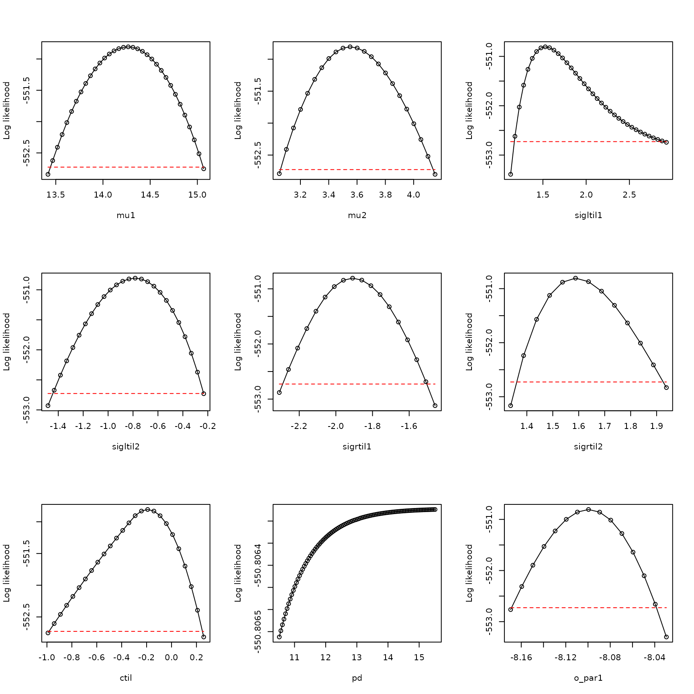
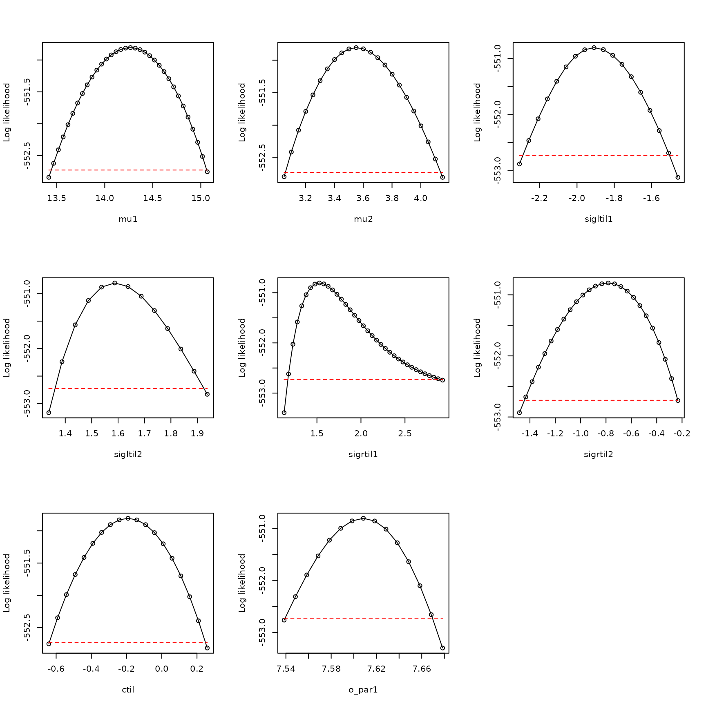

# Boundary models

\\ \newcommand{\mean}\[1\]{\overline{#1}} \newcommand{\var}{\text{var}}
\newcommand{\cov}{\text{cov}} \newcommand{\cor}{\text{cor}}
\newcommand{\Rp}{\text{Re}} \newcommand{\E}{\text{E}}
\newcommand{\ltsgr}{\text{ltsgr}} \newcommand{\expit}{\text{expit}}
\newcommand{\logit}{\text{logit}} \\

**Abstract.** We here show an example of the not uncommon case where the
seemingly best initial model considered does not show adequate evidence
that the likelihood function was fully optimized; the best parameters
obtained by optimization show \\p_d\\ close to \\1\\; and the profile
for \\p_d\\ is not dome shaped. The boundary model with \\p_d = 1\\ can
then be used. This example is based on occurrence data from GBIF for
*Blarina carolinensis*, the southern short-tailed shrew.

The southern short-tailed shrew, *Blarina carolinensis*, is found in the
southeastern United States.

We start by loading in the data:

``` r

library(xsdm)
env_array <- example_3$env_array
dim(env_array)
```

    ## [1] 1156   39    6

``` r

dimnames(env_array)[[3]]
```

    ## [1] "BIO01" "BIO10" "BIO11" "BIO12" "BIO16" "BIO17"

``` r

occ <- example_3$occ_vec
length(occ)
```

    ## [1] 1156

Here, there are 6 environmental variables recorded for 39 years in 1156
locations, with accompanying detections and pseudo-absences in the
variable `occ`. The first three environmental variables (BIO1, BIO10,
BIO11) are temperature variables, and the last three (BIO12, BIO16,
BIO17) are precipitation variables. BIO1 is mean annual temperature,
BIO10 is mean temperature of the warmest quarter, BIO11 is mean
temperature of the coldest quarter, BIO12 is annual precipitation, BIO16
is precipitation of the wettest quarter, and BIO17 is precipitation of
the driest quarter.

Now look at the distributions of values of environmental variables to
make sure they are not on wildly different scales, which could cause
problems for optimization:

``` r

apply(FUN=quantile, X=env_array, MARGIN=3, prob=c(.025,.25,.5,.75,.975))
```

    ##          BIO01 BIO10 BIO11     BIO12 BIO16   BIO17
    ## 2.5%  11.62000 21.71  1.48  76.36075  9.13  2.1300
    ## 25%   15.32000 25.25  6.29 108.63000 13.19  4.5075
    ## 50%   17.16000 26.45  9.06 126.30000 15.76  5.9500
    ## 75%   19.20000 27.44 11.99 146.79000 18.84  7.3800
    ## 97.5% 22.55925 29.22 17.61 190.28000 27.05 10.4200

These distributions look basically OK.

Now fit 15 models, each from 25 starting conditions:

``` r

models <- matrix(c(1,0,0,0,0,0,
                  0,1,0,0,0,0,
                  0,0,1,0,0,0,
                  0,0,0,1,0,0,
                  0,0,0,0,1,0,
                  0,0,0,0,0,1,
                  1,0,0,1,0,0,
                  1,0,0,0,1,0,
                  1,0,0,0,0,1,
                  0,1,0,1,0,0,
                  0,1,0,0,1,0,
                  0,1,0,0,0,1,
                  0,0,1,1,0,0,
                  0,0,1,0,1,0,
                  0,0,1,0,0,1), nrow=15, byrow=TRUE)
all_model_results <- list()
for (i in 1:nrow(models))
{
  env_dat <- env_array[,,models[i,]==1,drop=FALSE]
  starts <- start_parms(env_dat[occ==1,,,drop=FALSE],num_starts=25)
  all_optim_results <- list()
  for (j in 1:nrow(starts))
  {
    all_optim_results[[j]] <- optim(par=starts[j,],fn=loglik_math,
                                   method="BFGS",
                                   env_dat=env_dat, occ=occ,negative=TRUE,
                                   control=list(trace=0))
  }
  all_model_results[[i]] <- all_optim_results
}
```

Rank the models by BIC, bearing in mind that we’ve been working with the
negative of the likelihood:

``` r

model_BICs <- sapply(X=all_model_results,
                      FUN=function(x){
                        best_loglik = min(sapply(X=x, FUN=function(y){y$value}))
                        num_parms = length(x[[1]]$par)
                        n = length(occ)
                        BIC = 2*best_loglik + num_parms*log(n)
                        return(BIC)
                      }
                    )
```

Also by AIC, and compare the two:

``` r

model_AICs <- sapply(X=all_model_results,
                      FUN=function(x){
                        best_loglik = min(sapply(X=x, FUN=function(y){y$value}))
                        num_parms = length(x[[1]]$par)
                        AIC = 2*best_loglik + 2*num_parms
                        return(AIC)
                      }
                    )
inds <- order(model_BICs)
rbind(model_BICs[inds],model_AICs[inds])
```

    ##          [,1]     [,2]     [,3]     [,4]     [,5]     [,6]     [,7]     [,8]
    ## [1,] 1165.087 1172.644 1175.913 1190.903 1193.872 1194.662 1196.464 1201.075
    ## [2,] 1119.613 1127.170 1150.649 1145.429 1148.398 1149.187 1171.201 1155.600
    ##          [,9]    [,10]    [,11]    [,12]    [,13]    [,14]    [,15]
    ## [1,] 1201.277 1202.069 1210.063 1216.147 1288.862 1292.384 1310.536
    ## [2,] 1155.803 1156.595 1164.588 1190.883 1263.598 1267.121 1285.273

``` r

plot(model_BICs,model_AICs,type="p",xlab="BIC",ylab="AIC")
```


``` r

order(model_BICs)
```

    ##  [1]  9 12  2  7  8 15  1 11 10 13 14  3  5  4  6

``` r

order(model_AICs)
```

    ##  [1]  9 12  7  8 15  2 11 10 13 14  1  3  5  4  6

Looks like in this case the AIC and the BIC are reasonably aligned with
each other. Look at the best two models:

``` r

models[order(model_BICs)[1:2],]
```

    ##      [,1] [,2] [,3] [,4] [,5] [,6]
    ## [1,]    1    0    0    0    0    1
    ## [2,]    0    1    0    0    0    1

So these are two-variable models.

Let’s use the best model. Optimize it a bit harder:

``` r

i <- 9
env_dat <- env_array[,,models[i,]==1,drop=FALSE]
starts <- start_parms(env_dat[occ==1,,,drop=FALSE],num_starts=100)
best_model_results <- list()
for (j in 1:nrow(starts))
{
  best_model_results[[j]] <- optim(par=starts[j,],fn=loglik_math,
                                 method="BFGS",
                                 env_dat=env_dat, occ=occ,negative=TRUE,
                                 control=list(trace=0))
}
values <- sapply(X=best_model_results, FUN=function(y){y$value})
inds <- order(values)
best_model_results <- best_model_results[inds]
min(sapply(X=all_model_results[[i]], FUN=function(y){y$value}))
```

    ## [1] 550.8064

``` r

best_model_results[[1]]$value
```

    ## [1] 550.8064

Pretty similar, so we HAD pretty much fully optimized before.

Now have a look at the result for this model.

``` r

examine_optim_results <- function(optim_results,mask=NULL)
{
  #put optimization results in order from best to worst
  bestlogliks <- sapply(X=optim_results,FUN=function(x){x$value})
  inds <- order(bestlogliks)
  bestlogliks <- bestlogliks[inds]
  optim_results <- optim_results[inds]

  #model convergence
  convergences <- sapply(X=optim_results,FUN=function(x){x$convergence})

  #compute distances to the best result in parameter space
  best_parms_math <- optim_results[[1]]$par
  parms_dists_to_best <- lapply(
    X=optim_results,
    FUN=function(x){
      dist_between_params(
        x$par,
        best_parms_math,
        mask=mask,
        give_closest_rep=TRUE)
    }
  )
  parms_dists <- sapply(X=parms_dists_to_best, FUN=function(x){x$distance})

  #get the parameters from each optimization run which are closest to the first set
  bestparms <- sapply(X=parms_dists_to_best, FUN=function(x){unlist(x$representative)})

  #put it all together
  return(rbind(bestlogliks,convergences,parms_dists,bestparms))
}

h <- examine_optim_results(best_model_results)
t(h[,1:8])
```

    ##      bestlogliks convergences  parms_dists      mu1      mu2 sigltil1  sigltil2
    ## [1,]    550.8064            0 0.0000000000 14.26739 3.550976 4.605441 0.4572114
    ## [2,]    550.8064            0 0.0006586953 14.26706 3.551155 4.605143 0.4571020
    ## [3,]    550.8064            0 0.0003171643 14.26754 3.550946 4.605450 0.4572566
    ## [4,]    550.8064            0 0.0006132105 14.26707 3.551124 4.605419 0.4571075
    ## [5,]    550.8064            0 0.0008011962 14.26777 3.550840 4.605461 0.4573422
    ## [6,]    550.8064            0 0.0000799259 14.26737 3.550959 4.605582 0.4572064
    ## [7,]    550.8064            0 0.0003904173 14.26754 3.550937 4.605617 0.4572566
    ## [8,]    550.8064            0 0.0016968145 14.26737 3.551223 4.604871 0.4572748
    ##       sigrtil1 sigrtil2       ctil        pd     o_mat1     o_mat2    o_mat3
    ## [1,] 0.1482753 4.892247 -0.1916786 0.9999978 -0.2430936 -0.9700028 0.9700028
    ## [2,] 0.1482779 4.892511 -0.1917463 0.9999901 -0.2431073 -0.9699994 0.9699994
    ## [3,] 0.1482788 4.892006 -0.1917135 0.9999874 -0.2430854 -0.9700049 0.9700049
    ## [4,] 0.1482767 4.892354 -0.1917055 0.9999872 -0.2431085 -0.9699991 0.9699991
    ## [5,] 0.1482815 4.892294 -0.1916588 0.9999870 -0.2430725 -0.9700081 0.9700081
    ## [6,] 0.1482744 4.892272 -0.1916193 0.9999868 -0.2430970 -0.9700020 0.9700020
    ## [7,] 0.1482813 4.892361 -0.1916116 0.9999795 -0.2430852 -0.9700049 0.9700049
    ## [8,] 0.1483115 4.893160 -0.1916173 0.9999781 -0.2430938 -0.9700028 0.9700028
    ##          o_mat4
    ## [1,] -0.2430936
    ## [2,] -0.2431073
    ## [3,] -0.2430854
    ## [4,] -0.2431085
    ## [5,] -0.2430725
    ## [6,] -0.2430970
    ## [7,] -0.2430852
    ## [8,] -0.2430938

This looks good, in the sense that it looks like multiple optimizations
arrived at the same place in parameter space, which is some evidence
that we may have found the global maximum of the likelihood function.
The only problem is that \\p_d\\ is very close to \\1\\.

Let’s profile this model and see what we get:

``` r

pnames <- names(make_mask_names(2))

all_profiles <- list()
linc <- c(rep(0.05,8),0.01)
rinc <- c(rep(0.05,8),0.01)
for (counter in 1:9)
{
  all_profiles[[counter]] <- profile_likelihood(
                              profile_parameter=pnames[counter],
                              increment_left=linc[counter],
                              increment_right=rinc[counter],
                              num_steps_left=50,
                              num_steps_right=50,
                              alpha=0.95,
                              optim_param_vector=best_model_results[[1]]$par,
                              env_dat=env_dat,
                              occ=occ,
                              mask=NULL,
                              num_threads=6
                            )
}
names(all_profiles) <- pnames
```

Now plot these profiles:

``` r

plot_tool <- function(ap,index)
{
  x <- ap[[index]]$profile$value_math
  y <- ap[[index]]$profile$loglik
  xlab <- names(ap)[index]
  thresh <- ap[[index]]$threshold
  plot(x,y,
       type="o",xlab=xlab,
       ylab="Log likelihood")
  lines(range(x),rep(thresh,2),type="l",
        lty="dashed",col="red")
}

par(mfrow=c(3,3))
plot_tool(all_profiles,1)
plot_tool(all_profiles,2)
plot_tool(all_profiles,3)
plot_tool(all_profiles,4)
plot_tool(all_profiles,5)
plot_tool(all_profiles,6)
plot_tool(all_profiles,7)
plot_tool(all_profiles,8)
plot_tool(all_profiles,9)
```



So yes, the expected problem with `pd` is appearing. We cannot use a
model for which profiles do not show a dome-like pattern. This is a
common problem and it manifests in the manner illustrated here.

The solution is to use the boundary model with \\p_d = 1\\:

``` r

env_dat <- env_array[,,models[i,]==1,drop=FALSE]
dim(env_dat)
```

    ## [1] 1156   39    2

``` r

mask <- c(pd=Inf) #use Inf because masks are given on the math scale
mask
```

    ##  pd 
    ## Inf

``` r

new_starts <- start_parms(env_dat[occ==1,,,drop=FALSE],
                                  mask=mask,num_starts=100)
head(new_starts)
```

    ## # A tibble: 6 × 8
    ##     mu1   mu2 sigltil1 sigltil2 sigrtil1 sigrtil2   ctil o_par1
    ##   <dbl> <dbl>    <dbl>    <dbl>    <dbl>    <dbl>  <dbl>  <dbl>
    ## 1  15.6  7.89   0.299   1.05       1.19     0.702 -1.32   -3.39
    ## 2  18.1  5.24   0.992   0.355      0.498    1.40  -0.743   6.04
    ## 3  19.3  6.57  -0.0473  0.702      1.54     0.356 -1.60   -8.10
    ## 4  16.9  3.92   0.646   0.00881    0.844    1.05  -1.03    1.33
    ## 5  17.5  5.91   0.126   0.875      1.36     0.183 -1.46   -5.74
    ## 6  19.9  8.55   0.819   0.182      0.671    0.876 -0.886   3.68

``` r

bdry_optim_results <- list()
for (j in 1:nrow(new_starts))
{
  bdry_optim_results[[j]] <- optim(par=new_starts[j,],fn=loglik_math,
                                method="BFGS",
                                env_dat=env_dat,occ=occ,mask=mask,negative=TRUE,
                                control=list(trace=0,maxit=500))
}
```

Have a look at these results:

``` r

h <- examine_optim_results(bdry_optim_results,mask=mask)
t(h[,1:8])
```

    ##      bestlogliks convergences  parms_dists      mu1      mu2  sigltil1 sigltil2
    ## [1,]    550.8063            0 0.000000e+00 14.26741 3.550951 0.1482747 4.892239
    ## [2,]    550.8063            0 4.374443e-05 14.26740 3.550958 0.1482741 4.892262
    ## [3,]    550.8063            0 5.187592e-05 14.26744 3.550951 0.1482751 4.892222
    ## [4,]    550.8063            0 2.199448e-05 14.26741 3.550962 0.1482748 4.892246
    ## [5,]    550.8063            0 3.983488e-05 14.26740 3.550954 0.1482753 4.892266
    ## [6,]    550.8063            0 9.529778e-05 14.26745 3.550929 0.1482731 4.892174
    ## [7,]    550.8063            0 6.799521e-05 14.26739 3.550974 0.1482754 4.892249
    ## [8,]    550.8063            0 6.067718e-05 14.26740 3.550968 0.1482757 4.892246
    ##      sigrtil1  sigrtil2       ctil pd    o_mat1    o_mat2     o_mat3    o_mat4
    ## [1,] 4.605536 0.4572214 -0.1916681  1 0.2430902 0.9700037 -0.9700037 0.2430902
    ## [2,] 4.605472 0.4572158 -0.1916731  1 0.2430897 0.9700038 -0.9700038 0.2430897
    ## [3,] 4.605392 0.4572290 -0.1916862  1 0.2430872 0.9700044 -0.9700044 0.2430872
    ## [4,] 4.605468 0.4572182 -0.1916753  1 0.2430905 0.9700036 -0.9700036 0.2430905
    ## [5,] 4.605618 0.4572173 -0.1916540  1 0.2430890 0.9700040 -0.9700040 0.2430890
    ## [6,] 4.605459 0.4572284 -0.1916864  1 0.2430900 0.9700037 -0.9700037 0.2430900
    ## [7,] 4.605460 0.4572110 -0.1916809  1 0.2430915 0.9700034 -0.9700034 0.2430915
    ## [8,] 4.605406 0.4572140 -0.1916786  1 0.2430895 0.9700039 -0.9700039 0.2430895

This looks like enough of them converged to the same thing to say that
it looks like I successfully optimized. Get the likelihood:

``` r

values <- sapply(X=bdry_optim_results, FUN=function(y){y$value})
inds <- order(values)
bdry_optim_results <- bdry_optim_results[inds]
best_model_results[[1]]$value
```

    ## [1] 550.8064

``` r

bdry_optim_results[[1]]$value
```

    ## [1] 550.8063

So the likelihood is the same as for the previous (non-boundary) model.
But we have one less parameter that has been fitted. Get the AIC and BIC
to see the effects:

``` r

AIC <- unname(2*bdry_optim_results[[1]]$value+
               2*length(bdry_optim_results[[1]]$par))
AIC_old <- unname(2*best_model_results[[1]]$value+
                   2*length(best_model_results[[1]]$par))
AIC
```

    ## [1] 1117.613

``` r

AIC_old
```

    ## [1] 1119.613

``` r

AIC-AIC_old
```

    ## [1] -2.000019

``` r

BIC <- unname(2*bdry_optim_results[[1]]$value+
               log(length(occ))*length(bdry_optim_results[[1]]$par))
BIC_old <- unname(2*best_model_results[[1]]$value+
               log(length(occ))*length(best_model_results[[1]]$par))
BIC
```

    ## [1] 1158.034

``` r

BIC_old
```

    ## [1] 1165.087

``` r

BIC-BIC_old
```

    ## [1] -7.05274

``` r

log(length(occ))
```

    ## [1] 7.052721

So the AIC and BIC are better for the boundary model compared to the
earlier model, and by the expected amounts. We go with the boundary
model.

Let’s profile this boundary model and see what we get:

``` r

pnames <- names(make_mask_names(2))
pnames <- pnames[pnames!="pd"]
mask
```

    ##  pd 
    ## Inf

``` r

all_bdry_profiles <- list()
linc <- c(rep(0.05,7),0.01)
rinc <- c(rep(0.05,7),0.01)
for (counter in 1:8)
{
  all_bdry_profiles[[counter]] <- profile_likelihood(
                              profile_parameter=pnames[counter],
                              increment_left=linc[counter],
                              increment_right=rinc[counter],
                              num_steps_left=50,
                              num_steps_right=50,
                              alpha=0.95,
                              optim_param_vector=bdry_optim_results[[1]]$par,
                              env_dat=env_dat,
                              occ=occ,
                              mask=mask,
                              num_threads=6
                            )
}
names(all_bdry_profiles) <- pnames
```

Now plot these profiles:

``` r

par(mfrow=c(3,3))
plot_tool(all_bdry_profiles,1)
plot_tool(all_bdry_profiles,2)
plot_tool(all_bdry_profiles,3)
plot_tool(all_bdry_profiles,4)
plot_tool(all_bdry_profiles,5)
plot_tool(all_bdry_profiles,6)
plot_tool(all_bdry_profiles,7)
plot_tool(all_bdry_profiles,8)
```



These are sufficiently dome-shaped, suggesting the likelihood function
is sufficiently well-behaved in the vicinity of the maximum we found,
and inferences can be made. Note these profiles look essentially the
same as those obtained previously, except the \\\sigma\\ profiles have
been switched around (which can happen, given redundancy in parameters
explained in “How to fit xsdm models with species occurrence data using
xsdm”). The overall lesson is, when optimizing the xsdm likelihood
function gives a best model with \\p_d\\ close to \\1\\ and a
non-dome-shaped profile for \\p_d\\, use the boundary model with \\p_d =
1\\. We also saw a demonstration of the `xsdm` functionality for fitting
boundary models. Other boundary models can also be fitted. See the
document “Unusable models: when a model does not have a maximum
likelihood” for more examples of fitting boundary models.
