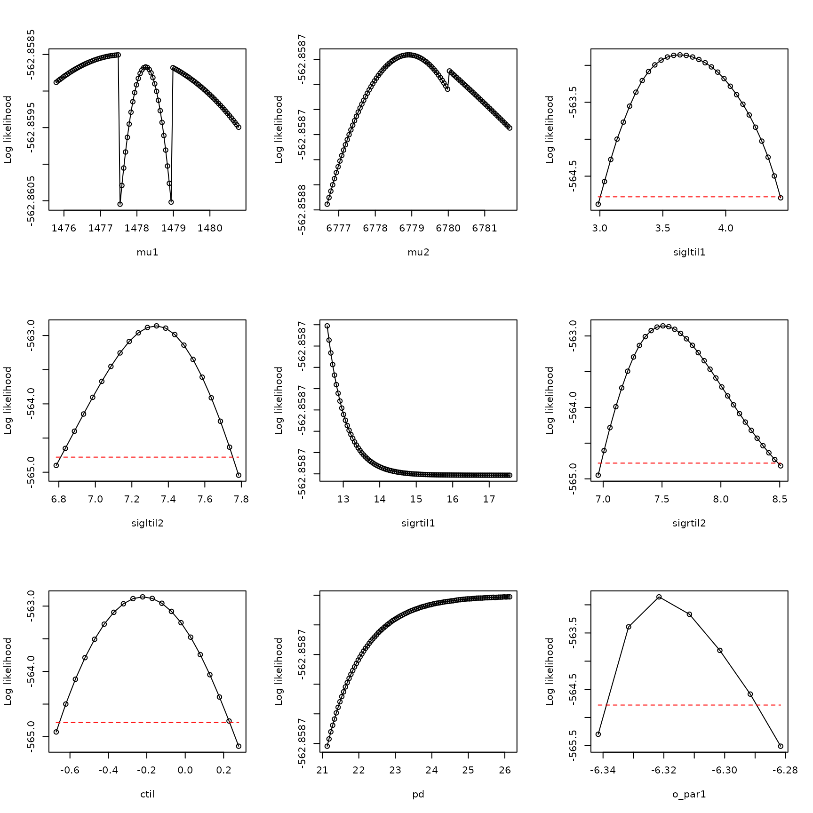
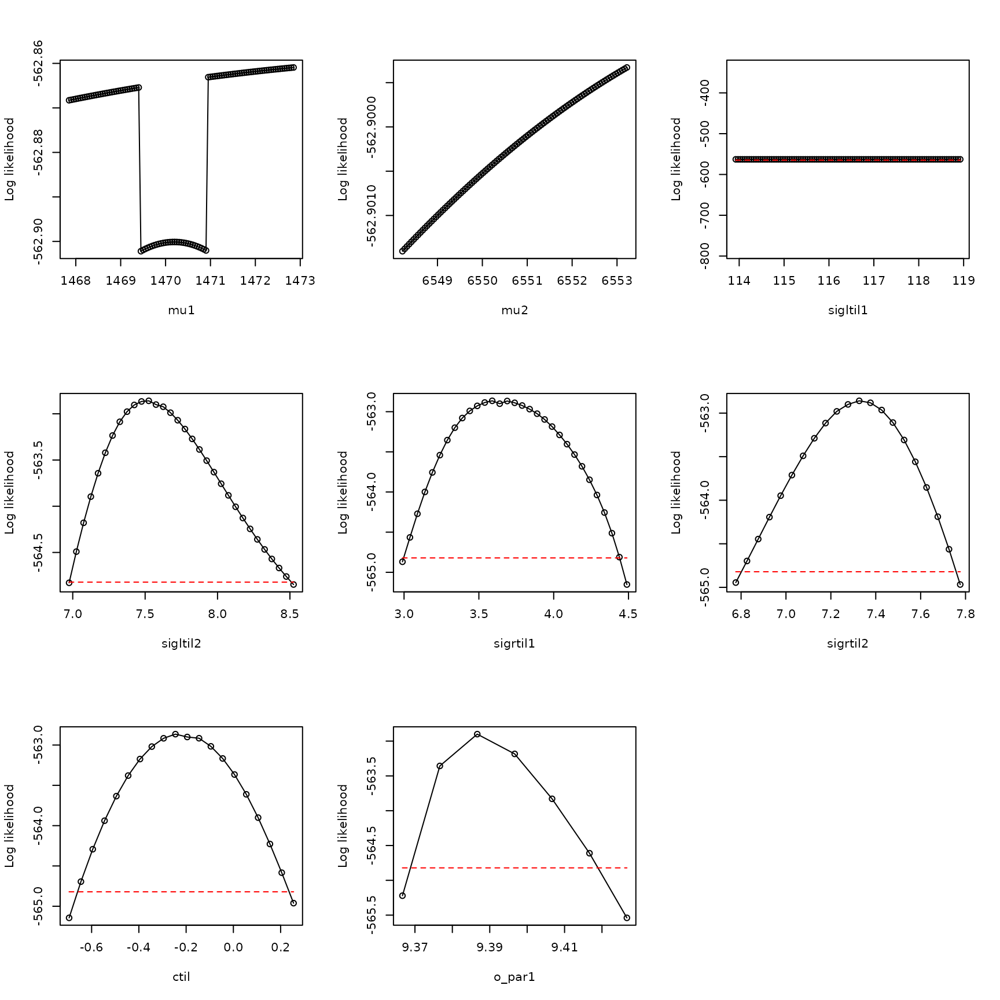

# Troubleshooting: boundary models, 1

**Abstract.** We here show a troublshooting example in the case where
the best model considered does not show adequate evidence that the
likelihood function was fully optimized, the best parameters obtained by
optimization show \\p_d\\ close to \\1\\, and the profile for \\p_d\\ is
not dome shaped. This is a common case. The boundary model with \\p_d =
1\\ is used. This example is based on occurrence data from GBIF for
*Blarina carolinensis*, the southern short-tailed shrew.

The southern short-tailed shrew, *Blarina carolinensis*, is found in the
southeastern United States.

We start by loading in the data:

``` r

library(xsdm)
env_array <- example_3$env_array
dim(env_array)
```

    ## [1] 1156   39    6

``` r

dimnames(env_array)[[3]]
```

    ## [1] "BIO01" "BIO10" "BIO11" "BIO12" "BIO16" "BIO17"

``` r

occ <- example_3$occ_vec
length(occ)
```

    ## [1] 1156

Here, there are 6 environmental variables recorded for 39 years in 1156
locations, with accompanying detections and pseudo-absences in the
variable `occ`. The first three environmental variables (BIO1, BIO10,
BIO11) are temperature variables, and the last three (BIO12, BIO16,
BIO17) are precipitation variables. BIO1 is mean annual temperature,
BIO10 is mean temperature of the warmest quarter, BIO11 is mean
temperature of the coldest quarter, BIO12 is annual precipitation, BIO16
is precipitation of the wettest quarter, and BIO17 is precipitation of
the driest quarter.

Now look at the distributions of values of environmental variables to
make sure they are not on wildly different scales, which would cause
problems for optimization:

``` r

apply(FUN=quantile, X=env_array, MARGIN=3,prob=c(.025,.25,.5,.75,.975))
```

    ##          BIO01 BIO10    BIO11     BIO12     BIO16    BIO17
    ## 2.5%  1161.075  2170  147.000  76359.98  9127.075  2133.00
    ## 25%   1531.000  2524  628.000 108627.75 13187.000  4504.75
    ## 50%   1716.000  2645  905.000 126297.00 15759.500  5947.00
    ## 75%   1920.000  2743 1199.000 146791.00 18836.250  7377.00
    ## 97.5% 2255.000  2921 1760.925 190281.85 27049.000 10421.85

These distributions look basically OK.

Now fit 15 models, each from 25 starting conditions:

``` r

models <- matrix(c(1,0,0,0,0,0,
                  0,1,0,0,0,0,
                  0,0,1,0,0,0,
                  0,0,0,1,0,0,
                  0,0,0,0,1,0,
                  0,0,0,0,0,1,
                  1,0,0,1,0,0,
                  1,0,0,0,1,0,
                  1,0,0,0,0,1,
                  0,1,0,1,0,0,
                  0,1,0,0,1,0,
                  0,1,0,0,0,1,
                  0,0,1,1,0,0,
                  0,0,1,0,1,0,
                  0,0,1,0,0,1), nrow=15, byrow=TRUE)
all_model_results <- list()
for (i in 1:nrow(models))
{
  env_dat <- env_array[,,models[i,]==1,drop=FALSE]
  starts <- xsdm::start_parms(env_dat,num_starts=25)
  all_optim_results <- list()
  for (j in 1:nrow(starts))
  {
    all_optim_results[[j]] <- optim(par=starts[j,],fn=xsdm::loglik_math,
                                   method="BFGS",
                                   env_dat=env_dat, occ=occ,negative=TRUE,
                                   control=list(trace=0))
  }
  all_model_results[[i]] <- all_optim_results
}
```

Rank the models by BIC, bearing in mind that we’ve been working with the
negative of the likelihood:

``` r

model_BICs <- sapply(X=all_model_results,
                      FUN=function(x){
                        best_loglik = min(sapply(X=x, FUN=function(y){y$value}))
                        num_parms = length(x[[1]]$par)
                        n = length(occ)
                        BIC = 2*best_loglik + num_parms*log(n)
                        return(BIC)
                      }
                    )
```

Also by AIC:

``` r

model_AICs <- sapply(X=all_model_results,
                      FUN=function(x){
                        best_loglik = min(sapply(X=x, FUN=function(y){y$value}))
                        num_parms = length(x[[1]]$par)
                        AIC = 2*best_loglik + 2*num_parms
                        return(AIC)
                      }
                    )
inds <- order(model_BICs)
rbind(model_BICs[inds],model_AICs[inds])
```

    ##          [,1]     [,2]     [,3]     [,4]     [,5]     [,6]     [,7]     [,8]
    ## [1,] 1175.877 1190.262 1192.969 1196.456 1200.647 1201.222 1204.078 1207.230
    ## [2,] 1150.614 1144.788 1147.494 1171.193 1155.173 1155.748 1158.603 1161.756
    ##          [,9]    [,10]    [,11]    [,12]    [,13]    [,14]    [,15]
    ## [1,] 1209.320 1212.812 1216.147 1220.282 1288.876 1292.388 1310.529
    ## [2,] 1163.846 1167.338 1190.884 1174.808 1263.613 1267.124 1285.266

``` r

plot(model_BICs,model_AICs,type="p",xlab="BIC",ylab="AIC")
```


``` r

order(model_BICs)
```

    ##  [1]  2  9  8  1 12 11 10 15  7 14  3 13  5  4  6

``` r

order(model_AICs)
```

    ##  [1]  9  8  2 12 11 10 15  7 14  1 13  3  5  4  6

Looks like in this case the AIC and the BIC are pretty aligned with each
other. Look at the best two model models:

``` r

models[order(model_BICs)[1:2],]
```

    ##      [,1] [,2] [,3] [,4] [,5] [,6]
    ## [1,]    0    1    0    0    0    0
    ## [2,]    1    0    0    0    0    1

So these are two-variable models.

Let’s use the best model. Optimize it a bit harder:

``` r

i <- 9
env_dat <- env_array[,,models[i,]==1,drop=FALSE]
starts <- xsdm::start_parms(env_dat,num_starts=100)
best_model_results <- list()
for (j in 1:nrow(starts))
{
  best_model_results[[j]] <- optim(par=starts[j,],fn=xsdm::loglik_math,
                                 method="BFGS",
                                 env_dat=env_dat, occ=occ,negative=TRUE,
                                 control=list(trace=0))
}
values <- sapply(X=best_model_results, FUN=function(y){y$value})
inds <- order(values)
best_model_results <- best_model_results[inds]
min(sapply(X=all_model_results[[i]], FUN=function(y){y$value}))
```

    ## [1] 563.3939

``` r

best_model_results[[1]]$value
```

    ## [1] 562.8587

Pretty similar, so we HAD pretty much fully optimized before.

Now have a look at the result for this model.

``` r

examine_optim_results <- function(optim_results,mask=NULL)
{
  #put optimization results in order from best to worst
  bestlogliks <- sapply(X=optim_results,FUN=function(x){x$value})
  inds <- order(bestlogliks)
  bestlogliks <- bestlogliks[inds]
  optim_results <- optim_results[inds]

  #model convergence
  convergences <- sapply(X=optim_results,FUN=function(x){x$convergence})

  #compute distances to the best result in parameter space
  best_parms_math <- optim_results[[1]]$par
  parms_dists_to_best <- lapply(
    X=optim_results,
    FUN=function(x){
      xsdm::dist_between_params(
        x$par,
        best_parms_math,
        mask=mask,
        give_closest_rep=TRUE)
    }
  )
  parms_dists <- sapply(X=parms_dists_to_best, FUN=function(x){x$distance})

  #look at the best 5 results in parameter space
  bestparms <- sapply(X=parms_dists_to_best, FUN=function(x){unlist(x$representative)})

  #put it all together
  return(rbind(bestlogliks,convergences,parms_dists,bestparms))
}

h <- examine_optim_results(best_model_results)
t(h[,1:8])
```

    ##      bestlogliks convergences parms_dists      mu1      mu2 sigltil1  sigltil2
    ## [1,]    562.8587            0     0.00000 1478.288 6779.183 37.95579 1533.6299
    ## [2,]    562.8702            0    82.65487 1486.023 6861.475 39.10897 1565.0234
    ## [3,]    562.9212            0   277.88604 1468.465 6501.470 38.06906 1426.9687
    ## [4,]    562.9715            1   335.78229 1488.951 7114.795 37.48311 1668.7665
    ## [5,]    563.1721            1   572.74563 1495.765 7351.661 36.89349 1767.7827
    ## [6,]    563.3939            0   815.85699 1446.005 5963.964 37.45006 1231.8531
    ## [7,]    564.5769            0  1597.28868 1419.411 5182.979 37.81957  967.3144
    ## [8,]    564.9956            0  1873.36467 1543.790 8651.402 35.05880 2489.7123
    ##          sigrtil1 sigrtil2        ctil        pd    o_mat1      o_mat2
    ## [1,] 3.471703e+06 1822.365 -0.22176309 1.0000000 0.9992624 -0.03840058
    ## [2,] 4.449833e+08 1773.453 -0.23426655 1.0000000 0.9992863 -0.03777374
    ## [3,] 2.243564e+19 1978.049 -0.18927402 1.0000000 0.9992762 -0.03804065
    ## [4,] 1.064765e+09 1665.131 -0.25280703 1.0000000 0.9992363 -0.03907328
    ## [5,] 1.720842e+05 1568.265 -0.27195783 0.9991513 0.9992138 -0.03964611
    ## [6,] 2.080082e+36 2360.227 -0.10974006 0.9999928 0.9992811 -0.03791213
    ## [7,] 6.536756e+05 3169.412  0.03071018 0.9999875 0.9993085 -0.03718188
    ## [8,] 1.187998e+03 1240.513 -0.29750341 1.0000000 0.9991233 -0.04186398
    ##          o_mat3    o_mat4
    ## [1,] 0.03840058 0.9992624
    ## [2,] 0.03777374 0.9992863
    ## [3,] 0.03804065 0.9992762
    ## [4,] 0.03907328 0.9992363
    ## [5,] 0.03964611 0.9992138
    ## [6,] 0.03791213 0.9992811
    ## [7,] 0.03718188 0.9993085
    ## [8,] 0.04186398 0.9991233

This looks good, in the sense that it looks like multiple optimizations
arrived at about the same place in parameter space, which is some
evidence that we may have found the global maximum of the likelihood
function The only problem is that \\p_d\\ is very close to \\1\\.

Let’s profile this model and see what we get:

``` r

pnames <- names(xsdm::make_mask_names(2))

all_profiles <- list()
linc <- c(rep(0.05,8),0.01)
rinc <- c(rep(0.05,8),0.01)
for (counter in 1:9)
{
  all_profiles[[counter]] <- xsdm::profile_likelihood(
                              profile_parameter=pnames[counter],
                              increment_left=linc[counter],
                              increment_right=rinc[counter],
                              num_steps_left=50,
                              num_steps_right=50,
                              alpha=0.95,
                              optim_param_vector=best_model_results[[1]]$par,
                              env_dat=env_dat,
                              occ=occ,
                              mask=NULL,
                              num_threads=6
                            )
}
names(all_profiles) <- pnames
```

Now plot these profiles:

``` r

plot_tool <- function(ap,index)
{
  x <- ap[[index]]$profile$value_math
  y <- ap[[index]]$profile$loglik
  xlab <- names(ap)[index]
  thresh <- ap[[index]]$threshold
  plot(x,y,
       type="o",xlab=xlab,
       ylab="Log likelihood")
  lines(range(x),rep(thresh,2),type="l",
        lty="dashed",col="red")
}

par(mfrow=c(3,3))
plot_tool(all_profiles,1)
plot_tool(all_profiles,2)
plot_tool(all_profiles,3)
plot_tool(all_profiles,4)
plot_tool(all_profiles,5)
plot_tool(all_profiles,6)
plot_tool(all_profiles,7)
plot_tool(all_profiles,8)
plot_tool(all_profiles,9)
```



So yes, there is the expected problem with pd. This is a common problem
and it manifests in the manner illustrated here.

The solution is to use the boundary model with \\p_d = 1\\:

``` r

env_dat <- env_array[,,models[i,]==1,drop=FALSE]
dim(env_dat)
```

    ## [1] 1156   39    2

``` r

mask <- c(pd=Inf) #use Inf because masks are given on the math scale
mask
```

    ##  pd 
    ## Inf

``` r

new_starts <- xsdm::start_parms(env_dat[occ==1,,,drop=FALSE],
                                  mask=mask,num_starts=100)
head(new_starts)
```

    ## # A tibble: 6 × 8
    ##     mu1   mu2 sigltil1 sigltil2 sigrtil1 sigrtil2   ctil o_par1
    ##   <dbl> <dbl>    <dbl>    <dbl>    <dbl>    <dbl>  <dbl>  <dbl>
    ## 1 1563. 5658.     4.84     8.00     5.17     8.17 -1.19    3.68
    ## 2 1808. 8301.     5.53     7.30     5.86     7.48 -0.617  -5.74
    ## 3 1930. 4337.     5.18     7.65     6.21     7.83 -0.904   8.39
    ## 4 1686. 6980.     4.49     6.96     5.51     7.13 -1.48   -1.03
    ## 5 1747. 3676.     5.36     8.17     6.03     7.31 -1.33   -8.10
    ## 6 1991. 6319.     4.66     7.48     5.34     8.00 -0.761   1.33

``` r

bdry_optim_results <- list()
for (j in 1:nrow(new_starts))
{
  bdry_optim_results[[j]] <- optim(par=new_starts[j,],fn=xsdm::loglik_math,
                                method="BFGS",
                                env_dat=env_dat,occ=occ,mask=mask,negative=TRUE,
                                control=list(trace=0,maxit=500))
}
```

Have a look at these results:

``` r

h <- examine_optim_results(bdry_optim_results,mask=mask)
t(h[,1:10])
```

    ##       bestlogliks convergences parms_dists      mu1      mu2      sigltil1
    ##  [1,]    562.9002            0      0.0000 1470.351 6550.720  3.650305e+50
    ##  [2,]    562.9292            0     65.4002 1468.907 6485.335 4.355508e+115
    ##  [3,]    562.9394            0    510.7775 1487.569 7061.207  2.608754e+41
    ##  [4,]    563.0534            0    674.8969 1492.517 7225.252  6.203427e+06
    ##  [5,]    563.1613            0    373.2336 1450.361 6178.022  1.612125e+28
    ##  [6,]    563.1932            0    407.4726 1452.969 6143.618  5.521264e+23
    ##  [7,]    563.4037            0    592.9562 1440.148 5958.533  3.865264e+25
    ##  [8,]    563.5083            0   1085.8331 1506.530 7635.950  4.467936e+17
    ##  [9,]    563.5559            0    715.0945 1438.230 5836.347  1.532636e+30
    ## [10,]    563.8103            0    897.5382 1431.387 5654.028  1.380849e+06
    ##       sigltil2 sigrtil1 sigrtil2        ctil pd     o_mat1     o_mat2
    ##  [1,] 1948.869 38.06199 1445.710 -0.19527781  1 -0.9992736 0.03810946
    ##  [2,] 1985.843 38.30367 1420.717 -0.18816895  1 -0.9992829 0.03786480
    ##  [3,] 1687.275 37.64312 1646.448 -0.24873954  1 -0.9992428 0.03890858
    ##  [4,] 1617.910 37.30315 1714.377 -0.26185939  1 -0.9992281 0.03928347
    ##  [5,] 2202.565 36.70114 1308.798 -0.14011297  1 -0.9992552 0.03858739
    ##  [6,] 2218.921 37.54005 1295.533 -0.13850299  1 -0.9992761 0.03804282
    ##  [7,] 2375.892 36.27427 1230.767 -0.10465808  1 -0.9992516 0.03868011
    ##  [8,] 1460.131 36.79942 1890.551 -0.29049505  1 -0.9991991 0.04001483
    ##  [9,] 2474.156 36.84554 1187.185 -0.08642543  1 -0.9992674 0.03827113
    ## [10,] 2642.041 36.76817 1124.490 -0.05553320  1 -0.9992734 0.03811471
    ##            o_mat3     o_mat4
    ##  [1,] -0.03810946 -0.9992736
    ##  [2,] -0.03786480 -0.9992829
    ##  [3,] -0.03890858 -0.9992428
    ##  [4,] -0.03928347 -0.9992281
    ##  [5,] -0.03858739 -0.9992552
    ##  [6,] -0.03804282 -0.9992761
    ##  [7,] -0.03868011 -0.9992516
    ##  [8,] -0.04001483 -0.9991991
    ##  [9,] -0.03827113 -0.9992674
    ## [10,] -0.03811471 -0.9992734

This looks like enough of them converged to the same thing to say that
it looks like I successfully optimized. Get the likelihood:

``` r

values <- sapply(X=bdry_optim_results, FUN=function(y){y$value})
inds <- order(values)
bdry_optim_results <- bdry_optim_results[inds]
best_model_results[[1]]$value
```

    ## [1] 562.8587

``` r

bdry_optim_results[[1]]$value
```

    ## [1] 562.9002

So the likelihood is the same as for the previous (non-boundary) model.
But we have one less parameter that has been fitted. Get the AIC and BIC
to see the effects:

``` r

AIC <- unname(2*bdry_optim_results[[1]]$value+
               2*length(bdry_optim_results[[1]]$par))
AIC_old <- unname(2*best_model_results[[1]]$value+
                   2*length(best_model_results[[1]]$par))
AIC
```

    ## [1] 1141.8

``` r

AIC_old
```

    ## [1] 1143.717

``` r

AIC-AIC_old
```

    ## [1] -1.916928

``` r

BIC <- unname(2*bdry_optim_results[[1]]$value+
               log(length(occ))*length(bdry_optim_results[[1]]$par))
BIC_old <- unname(2*best_model_results[[1]]$value+
               log(length(occ))*length(best_model_results[[1]]$par))
BIC
```

    ## [1] 1182.222

``` r

BIC_old
```

    ## [1] 1189.192

``` r

BIC-BIC_old
```

    ## [1] -6.969649

``` r

log(length(occ))
```

    ## [1] 7.052721

So the AIC and BIC are better for the boundary model compared to the
earlier model, and by the expected amounts. We go with the simpler
model.

Let’s profile this boundary model and see what we get:

``` r

pnames <- names(xsdm::make_mask_names(2))
pnames <- pnames[pnames!="pd"]
mask
```

    ##  pd 
    ## Inf

``` r

all_bdry_profiles <- list()
linc <- c(rep(0.05,7),0.01)
rinc <- c(rep(0.05,7),0.01)
for (counter in 1:8)
{
  all_bdry_profiles[[counter]] <- xsdm::profile_likelihood(
                              profile_parameter=pnames[counter],
                              increment_left=linc[counter],
                              increment_right=rinc[counter],
                              num_steps_left=50,
                              num_steps_right=50,
                              alpha=0.95,
                              optim_param_vector=bdry_optim_results[[1]]$par,
                              env_dat=env_dat,
                              occ=occ,
                              mask=mask,
                              num_threads=6
                            )
}
names(all_bdry_profiles) <- pnames
```

Now plot these profiles:

``` r

par(mfrow=c(3,3))
plot_tool(all_bdry_profiles,1)
plot_tool(all_bdry_profiles,2)
plot_tool(all_bdry_profiles,3)
plot_tool(all_bdry_profiles,4)
plot_tool(all_bdry_profiles,5)
plot_tool(all_bdry_profiles,6)
plot_tool(all_bdry_profiles,7)
plot_tool(all_bdry_profiles,8)
```



These are dome-shaped, suggesting the likelihood function is
well-behaved in the vacinity of the maximum we found, and inferences can
be made. Note these profiles look essentially the same as those obtained
previously, except \\\vec{\sigma}\_L\\ and \\\vec{\sigma}\_R\\ have been
switched (which can happen, given redundancy in parameters explained in
“How to fit xsdm models with species occurrence data using xsdm”). The
overall lesson is, when optimizing the xsdm likelihood function gives a
best model with \\p_d\\ close to \\1\\ and a non-dome-shaped profile for
\\p_d\\, use the boundary model with \\p_d = 1\\.
