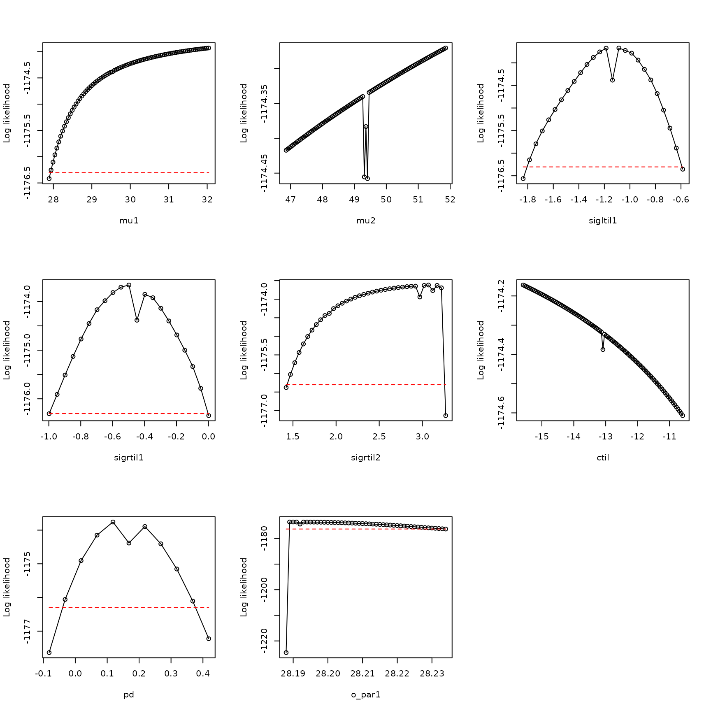
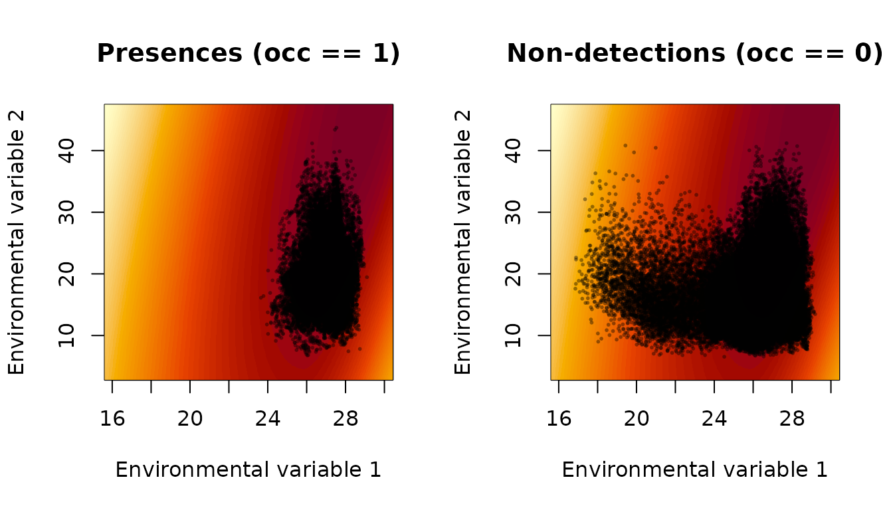
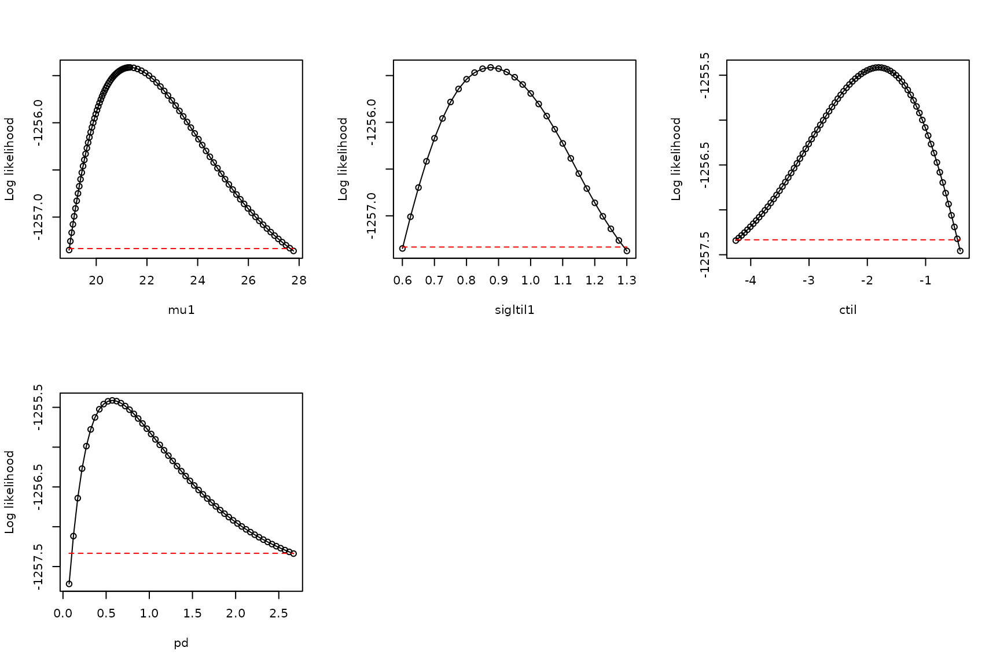

# Unusable models: when a model does not have a maximum likelihood

\\ \newcommand{\mean}\[1\]{\overline{#1}} \newcommand{\var}{\text{var}}
\newcommand{\cov}{\text{cov}} \newcommand{\cor}{\text{cor}}
\newcommand{\Rp}{\text{Re}} \newcommand{\E}{\text{E}}
\newcommand{\ltsgr}{\text{ltsgr}} \newcommand{\expit}{\text{expit}}
\newcommand{\logit}{\text{logit}} \\

**Abstract.** When an xsdm model does not have a maximum likelihood, it
should not be used. This document shows an example of how that can
occur, and how to diagnose it. Along the way, another type of boundary
model (in addition to the \\p_d=1\\ case described elsewhere) is
illustrated, where sigma parameters are set to infinity, corresponding
to insensitivity of annual net growth to environmental changes in a
certain direction in environment space.

The Eastern glass lizard, *Ophisaurus ventralis*, is a legless lizard
found in the southeastern United States. It is the longest and heaviest
species of its genus, growing up to 108cm in total length.

We start by loading the data:

``` r

library(xsdm)
env_array <-  example_2$env_array

dim(env_array)
```

    ## [1] 2728   39    6

``` r

dimnames(env_array)[[3]]
```

    ## [1] "BIO01" "BIO10" "BIO11" "BIO12" "BIO16" "BIO17"

``` r

occ <-  example_2$occ_vec
length(occ)
```

    ## [1] 2728

Here, there are 6 environmental variables recorded for 39 years in 2728
locations, with accompanying detections and pseudo-absences in the
variable `occ`. The first three environmental variables (BIO1, BIO10,
BIO11) are temperature variables, and the last three (BIO12, BIO16,
BIO17) are precipitation variables. BIO1 is mean annual temperature,
BIO10 is mean temperature of the warmest quarter, BIO11 is mean
temperature of the coldest quarter, BIO12 is annual precipitation, BIO16
is precipitation of the wettest quarter, and BIO17 is precipitation of
the driest quarter.

Now look at the distributions of values of environmental variables to
make sure they are not on very different scales, which would cause
problems for optimization:

``` r

apply(FUN=quantile, X=env_array, MARGIN=3,prob=c(.025,.25,.5,.75,.975))
```

    ##          BIO01    BIO10     BIO11     BIO12    BIO16     BIO17
    ## 2.5%  12.21381 21.39449  3.847143  88.08287 10.14201  2.213420
    ## 25%   16.87778 25.76851  8.884324 114.44185 14.34298  4.366665
    ## 50%   18.71020 26.63721 11.528053 131.57598 17.40133  5.776966
    ## 75%   20.42655 27.33272 14.381416 151.15700 20.91240  7.222351
    ## 97.5% 24.29674 28.29841 20.728660 195.81223 29.55371 10.721530

These distributions look basically OK.

Now fit 15 models, each from 25 starting conditions:

``` r

models <- matrix(c(1,0,0,0,0,0,
                  0,1,0,0,0,0,
                  0,0,1,0,0,0,
                  0,0,0,1,0,0,
                  0,0,0,0,1,0,
                  0,0,0,0,0,1,
                  1,0,0,1,0,0,
                  1,0,0,0,1,0,
                  1,0,0,0,0,1,
                  0,1,0,1,0,0,
                  0,1,0,0,1,0,
                  0,1,0,0,0,1,
                  0,0,1,1,0,0,
                  0,0,1,0,1,0,
                  0,0,1,0,0,1), nrow=15, byrow=TRUE)
all_model_results <- list()
for (i in 1:nrow(models))
{
  print(i)
  env_dat <-  env_array[ , , models[i,]==1, drop = FALSE]
  starts <-  xsdm::start_parms(env_dat,num_starts=25)
  all_optim_results <-  list()
  for (j in 1:nrow(starts))
  {
    all_optim_results[[j]] <-  optim(par = starts[j,],
                                   fn = xsdm::loglik_math,
                                   method = "BFGS",
                                   env_dat = env_dat,
                                   occ = occ,
                                   negative=TRUE,
                                   control = list(trace=0)
                                   )
  }
  all_model_results[[i]] <- all_optim_results
}
```

    ## [1] 1
    ## [1] 2
    ## [1] 3
    ## [1] 4
    ## [1] 5
    ## [1] 6
    ## [1] 7
    ## [1] 8
    ## [1] 9
    ## [1] 10
    ## [1] 11
    ## [1] 12
    ## [1] 13
    ## [1] 14
    ## [1] 15

Within each model, rank the optimization results:

``` r

for (i in 1:length(all_model_results))
{
  values <-  sapply(X = all_model_results[[i]], FUN=function(x){x$value})
  inds <-  order(values)
  all_model_results[[i]] <-  all_model_results[[i]][inds]
}
```

Rank the models by BIC, bearing in mind that we’ve been working with the
negative of the likelihood:

``` r

model_BICs <- sapply(X=all_model_results,
                      FUN=function(x){
                        best_loglik = x[[1]]$value
                        num_parms = length(x[[1]]$par)
                        n = length(occ)
                        BIC = 2*best_loglik + num_parms*log(n)
                        return(BIC)
                      }
                    )
```

Also by AIC, then display:

``` r

model_AICs <- sapply(X=all_model_results,
                      FUN=function(x){
                        best_loglik = x[[1]]$value
                        num_parms = length(x[[1]]$par)
                        AIC = 2*best_loglik + 2*num_parms
                        return(AIC)
                      }
                    )

inds <- order(model_BICs)
rbind(model_BICs[inds],model_AICs[inds])
```

    ##          [,1]     [,2]     [,3]     [,4]     [,5]     [,6]     [,7]     [,8]
    ## [1,] 2419.976 2475.012 2483.864 2550.383 2580.205 2586.123 2593.541 2595.887
    ## [2,] 2366.774 2421.810 2430.662 2520.826 2550.648 2556.567 2540.339 2542.685
    ##          [,9]    [,10]    [,11]    [,12]    [,13]    [,14]    [,15]
    ## [1,] 2598.207 2602.745 2604.566 2676.652 2682.972 2915.417 2945.895
    ## [2,] 2545.005 2549.543 2551.364 2647.095 2629.771 2885.860 2916.339

``` r

plot(model_BICs,model_AICs,type="p",xlab="BIC",ylab="AIC")
```


``` r

order(model_BICs)
```

    ##  [1] 11  8 14  5  3  1 13 15  7 10  9  2 12  4  6

``` r

order(model_AICs)
```

    ##  [1] 11  8 14  5 13 15  7 10  3  9  1 12  2  4  6

The AIC and BIC results are pretty well aligned, and the four best
models are the same:

``` r

models[order(model_BICs)[1:4],]
```

    ##      [,1] [,2] [,3] [,4] [,5] [,6]
    ## [1,]    0    1    0    0    1    0
    ## [2,]    1    0    0    0    1    0
    ## [3,]    0    0    1    0    1    0
    ## [4,]    0    0    0    0    1    0

These four models all use the same predictor, the fifth one, and then
some use various possible second predictors.

We emphasize that these BIC and AIC values may or may not be meaningful,
since B/AIC can only be computed when the likelihood has been
effectively maximized. We will elaborate below, but for now we accept
these are pseudo-BIC and pseudo-AIC values, subject to later validation
or rejection.

Among the models we fitted, there is one clear winner in pseudo-BIC (the
model with the lowest pseudo-BIC). So let’s investigate it further.
Start by optimizing it a bit harder to see if we can do any better.

``` r

i <- 11
env_dat <- env_array[,,models[i,]==1,drop=FALSE]
starts <- xsdm::start_parms(env_dat, num_starts = 100)
model_11_results <- list()
for (j in 1:nrow(starts))
{
  model_11_results[[j]] <- optim(par=starts[j,],fn=xsdm::loglik_math,
                                method="BFGS",
                                env_dat = env_dat,
                                occ = occ,negative=TRUE,
                                control = list(trace=0))
}
all_model_results[[11]][[1]]$value
```

    ## [1] 1174.387

``` r

min(sapply(X=model_11_results, FUN=function(y){y$value}))
```

    ## [1] 1174.358

We did slightly better.

Now move forward by looking at the results for this model, starting by
writing a convenience function for examine optimization results:

``` r

examine_optim_results <- function(optim_results,mask=NULL)
{
  #put optimization results in order from best to worst
  bestlogliks <- sapply(X=optim_results,FUN=function(x){x$value})
  inds <- order(bestlogliks)
  bestlogliks <- bestlogliks[inds]
  optim_results <- optim_results[inds]

  #model convergence
  convergences <- sapply(X=optim_results,FUN=function(x){x$convergence})

  #compute distances to the best result in parameter space
  best_parms_math <- optim_results[[1]]$par
  parms_dists_to_best <- lapply(
    X=optim_results,
    FUN=function(x){
      xsdm::dist_between_params(
        x$par,
        best_parms_math,
        mask=mask,
        give_closest_rep=TRUE)
    }
  )
  parms_dists <- sapply(X=parms_dists_to_best, FUN=function(x){x$distance})
  bestparms <- sapply(X=parms_dists_to_best, FUN=function(x){unlist(x$representative)})

  #put it all together
  return(rbind(bestlogliks,convergences,parms_dists,bestparms))
}

h <- examine_optim_results(all_model_results[[11]])
t(h[ ,1:8])
```

    ##      bestlogliks convergences parms_dists      mu1      mu2 sigltil1  sigltil2
    ## [1,]    1174.387            1   0.0000000 29.57020 49.29810 6.756977 0.3229890
    ## [2,]    1174.401            0   0.5859204 29.51797 48.76833 6.712916 0.3204482
    ## [3,]    1174.402            0   0.9789580 29.48883 48.51728 6.743663 0.3206293
    ## [4,]    1174.501            0   4.5949969 29.27613 45.08749 6.389406 0.3216162
    ## [5,]    1174.651            0   8.1485420 29.02521 41.69399 5.967757 0.3223082
    ## [6,]    1174.914            1  11.1587772 28.75596 38.79300 5.554391 0.3166147
    ## [7,]    1175.863            1  17.9850159 28.24080 32.26778 4.556045 0.3343546
    ## [8,]    1191.515            1  26.0302129 25.49789 25.89912 3.692422 0.1491745
    ##          sigrtil1  sigrtil2       ctil        pd     o_mat1    o_mat2
    ## [1,] 7.046197e+07 0.6289928 -13.341008 0.5391707 0.08390085 0.9964741
    ## [2,] 1.384284e+03 0.6350676 -13.097945 0.5397470 0.08322911 0.9965304
    ## [3,] 7.271401e+00 0.6414683 -12.773869 0.5423547 0.08273170 0.9965719
    ## [4,] 7.432221e+01 0.6429637 -11.525366 0.5447050 0.08524555 0.9963600
    ## [5,] 3.051849e+03 0.6411525 -10.463891 0.5446606 0.08697090 0.9962109
    ## [6,] 1.675251e+02 0.6467664  -9.667969 0.5407474 0.08542828 0.9963443
    ## [7,] 1.450113e+03 0.6305582  -7.715589 0.5425700 0.09176909 0.9957803
    ## [8,] 2.001261e+02 1.4406561  -3.561796 0.6463683 0.05403175 0.9985392
    ##          o_mat3      o_mat4
    ## [1,] -0.9964741  0.08390085
    ## [2,] -0.9965304  0.08322911
    ## [3,] -0.9965719  0.08273170
    ## [4,] -0.9963600  0.08524555
    ## [5,] -0.9962109  0.08697090
    ## [6,] -0.9963443  0.08542828
    ## [7,] -0.9957803  0.09176909
    ## [8,]  0.9985392 -0.05403175

The very large values of `sigltil2` suggest the boundary model where
this parameter is set to `Inf`, corresponding to a direction in
environment space along which annual net growth is insensitive to
changes in the environment.

So we consider the corresponding boundary model:

``` r

i <- 11
env_dat <- env_array[ , , models[i,] == 1, drop=FALSE]
mask <- c(sigltil2 = Inf)
new_starts <- xsdm::start_parms(env_dat[occ == 1, , , drop=FALSE],
                               mask = mask,
                               num_starts = 100)

bdry_optim_results <- list()
for (j in 1:nrow(new_starts))
{
  bdry_optim_results[[j]] <- optim(par = new_starts[j,],
                                  fn = xsdm::loglik_math,
                                  method = "BFGS",
                                  env_dat = env_dat,
                                  occ = occ,
                                  mask = mask,
                                  negative = TRUE,
                                  control = list(trace=0, maxit=500))
}
```

Now look at these results:

``` r

h <- examine_optim_results(bdry_optim_results, mask = mask)
t(h[ ,1:8])
```

    ##      bestlogliks convergences parms_dists      mu1      mu2  sigltil1 sigltil2
    ## [1,]    1174.383            0    0.000000 29.54018 49.36105 0.3210456      Inf
    ## [2,]    1174.428            0    2.270107 29.40971 47.22162 0.3260759      Inf
    ## [3,]    1174.429            0    1.605016 29.45947 47.78484 0.3213987      Inf
    ## [4,]    1174.459            0    3.552250 29.36449 46.03792 0.3221828      Inf
    ## [5,]    1174.460            0    3.721816 29.38319 45.86091 0.3189471      Inf
    ## [6,]    1174.461            0    3.348700 29.34209 46.19974 0.3227267      Inf
    ## [7,]    1174.467            0    3.816496 29.33221 45.75031 0.3249694      Inf
    ## [8,]    1174.514            0    4.440936 29.27391 45.10866 0.3203804      Inf
    ##       sigrtil1 sigrtil2      ctil        pd     o_mat1     o_mat2      o_mat3
    ## [1,] 0.6388589 6.828110 -13.08712 0.5419305 -0.9966100 0.08227152 -0.08227152
    ## [2,] 0.6323058 6.605075 -12.34106 0.5432132 -0.9964342 0.08437295 -0.08437295
    ## [3,] 0.6319924 6.600745 -12.79593 0.5395897 -0.9964516 0.08416780 -0.08416780
    ## [4,] 0.6413753 6.500209 -11.84444 0.5441682 -0.9963309 0.08558412 -0.08558412
    ## [5,] 0.6438809 6.470119 -11.83188 0.5438304 -0.9962602 0.08640397 -0.08640397
    ## [6,] 0.6387116 6.487872 -12.00068 0.5428971 -0.9964215 0.08452320 -0.08452320
    ## [7,] 0.6327994 6.436740 -11.86922 0.5432412 -0.9963061 0.08587280 -0.08587280
    ## [8,] 0.6352971 6.314430 -11.83495 0.5410060 -0.9963489 0.08537497 -0.08537497
    ##          o_mat4
    ## [1,] -0.9966100
    ## [2,] -0.9964342
    ## [3,] -0.9964516
    ## [4,] -0.9963309
    ## [5,] -0.9962602
    ## [6,] -0.9964215
    ## [7,] -0.9963061
    ## [8,] -0.9963489

The best likelihoods obtained for this boundary model are very similar
to those obtained for the initial, non-boundary model, and the boundary
model has one fewer parameter, so we tentatively adopt the boundary
model over the earlier model. However, these optimization results reveal
that we probably still have not successfully optimized the likelihood,
or that the likelihood surface may have a ridge or an asymptote or other
pathological feature. One sees this by observing that whereas the top
several optimization results are similar in likelihood, they are spread
out in parameter space (the `parms_dists` column shows distance in
parameter space to the top-likelihood result).

To investigate the model further, we profile:

``` r

pnames <-  names(xsdm::make_mask_names(2))
pnames <-  pnames[!(pnames %in% names(mask))]

values <-  sapply(X=bdry_optim_results, FUN=function(x){x$value})
inds <-  order(values)
bdry_optim_results <-  bdry_optim_results[inds]

all_profiles <- list()
linc <-  rep(0.05, length(pnames))
rinc <-  rep(0.05, length(pnames))
linc[8] <-  0.001
rinc[8] <-  0.001
for (counter in 1:length(pnames))
{
  all_profiles[[counter]] <-  xsdm::profile_likelihood(
                              profile_parameter = pnames[counter],
                              increment_left =linc[counter],
                              increment_right = rinc[counter],
                              num_steps_left = 50,
                              num_steps_right = 50,
                              alpha = 0.95,
                              optim_param_vector = bdry_optim_results[[1]]$par,
                              env_dat=env_dat,
                              occ = occ,
                              mask = mask,
                              num_threads = 6
                            )
}
names(all_profiles) <-  pnames
```

Now plot these profiles:

``` r

plot_tool <- function(ap,index)
  {
  x <- ap[[index]]$profile$value_math
  y <- ap[[index]]$profile$loglik
  xlab <- names(ap)[index]
  thresh <- ap[[index]]$threshold
  plot(x,y,
       type="o",xlab=xlab,
       ylab="Log likelihood")
  lines(range(x),rep(thresh,2),type="l",
        lty="dashed",col="red")
}

par(mfrow=c(3,3))
plot_tool(all_profiles, 1)
plot_tool(all_profiles, 2)
plot_tool(all_profiles, 3)
plot_tool(all_profiles, 4)
plot_tool(all_profiles, 5)
plot_tool(all_profiles, 6)
plot_tool(all_profiles, 7)
plot_tool(all_profiles, 8)
```



These profiles are not dome-shaped, and have other idiosyncratic
features, confirming that we had not effectively optimized the
likelihood. The `mu2`, `mu2`, and `ctil` profile, in particular, show
problems.

We do a pairs plot based on the `mu2` profile to investigate further:

``` r

p <- all_profiles[[2]]$parameters
head(p)
```

    ##        mu1      mu2  sigltil1   sigrtil1 sigrtil2      ctil        pd   o_par1
    ## 1 29.48830 46.86105 -1.125491 -0.4557567 1.884494 -12.18998 0.1752261 28.18643
    ## 2 29.49244 46.91105 -1.125463 -0.4558283 1.885342 -12.20692 0.1751763 28.18644
    ## 3 29.49657 46.96105 -1.125436 -0.4558988 1.886187 -12.22387 0.1751268 28.18645
    ## 4 29.50070 47.01105 -1.125408 -0.4559709 1.887032 -12.24082 0.1750787 28.18645
    ## 5 29.50483 47.06105 -1.125381 -0.4560410 1.887874 -12.25776 0.1750283 28.18646
    ## 6 29.50896 47.11105 -1.125354 -0.4561114 1.888716 -12.27471 0.1749793 28.18647
    ##   sigltil2
    ## 1      Inf
    ## 2      Inf
    ## 3      Inf
    ## 4      Inf
    ## 5      Inf
    ## 6      Inf

``` r

p <- p[,1:8]
pairs(p)
```


This pairs plot helps us see the tradeoff going on between parameters.
As `mu2` is increased, other parameters, especially `ctil`, change
monotonically. These results suggest a ridge in the likelihood surface
that appears to rise asymptotically along some path in parameter space
for which `mu2` is increasing. We have not identified a maximum of the
likelihood function, and it looks as though there may not be one if the
increase is indeed asymptotic.

We look at what the growth-environment function looks like for the best
parameters we have found so far, maybe that will give some insight into
what is going wrong:

``` r

param_list <- bdry_optim_results[[1]]$par
param_list["sigltil2"] <- Inf
param_list <- param_list[names(xsdm::make_mask_names(2))]
param_list_bio <- xsdm::math_to_bio(param_list)
xsdm::interpret_parameters(param_list = param_list_bio,
                          plot_indices = c(1,2), env_dat=env_dat, occ = occ)
```



``` r

param_list_bio$mu
```

    ## [1] 29.54018 49.36105

Estimated values of `mu2` are outside the range of the environmental
data. The actual distribution of the species is across Florida and along
the coasts of the Southeastern United States, and the southern extent of
the species is very likely constrained, on the southern end of the
range, by the Atlantic Ocean and the Gulf of Mexico rather than by
temperature and precipitation. Ultimately the modeling probably fails
here for these reasons. A Bayesian approach to the same problem could
likely address some of the limitations, here, by setting appropriate
priors. In the frequentist setting, one must discard the model. AIC and
BIC values are invalid when the likelihood has not been adequately
optimized and when the likelihood surface in the vicinity of the optimum
is not approximately a dome.

Immediate next steps should include examination of the second- and
third-best models according to pseudo-BIC, to see if they have similar
problems. For brevity and because we are just trying to illustrate
statistical principles and workflows, we skip straight to examining the
fourth-best model, which may be simpler because it only uses one
environmental variable.

``` r

i <- 5
model_5_optim_results <-  all_model_results[[i]]
h <- examine_optim_results(model_5_optim_results)
t(h[,1:8])
```

    ##      bestlogliks convergences  parms_dists       mu  sigltil      sigrtil
    ## [1,]    1255.413            0 0.0000000000 21.33107 2.399377 2.118516e+10
    ## [2,]    1255.413            0 0.0004197821 21.33126 2.399545 2.920212e+06
    ## [3,]    1255.413            0 0.0043099086 21.33486 2.400216 6.664093e+02
    ## [4,]    1255.413            0 0.0026177746 21.33112 2.399409 3.823882e+02
    ## [5,]    1255.413            0 0.0048557198 21.33091 2.399476 2.081599e+02
    ## [6,]    1255.413            0 0.0050103153 21.33193 2.399567 2.028698e+02
    ## [7,]    1255.413            0 0.0085735571 21.33750 2.400909 1.924419e+02
    ## [8,]    1255.413            0 0.0077033263 21.32708 2.398714 1.601479e+02
    ##           ctil        pd o_mat
    ## [1,] -1.806885 0.6389692     1
    ## [2,] -1.806516 0.6390226     1
    ## [3,] -1.808277 0.6388442     1
    ## [4,] -1.806788 0.6390008     1
    ## [5,] -1.806209 0.6390998     1
    ## [6,] -1.807133 0.6389728     1
    ## [7,] -1.809112 0.6387623     1
    ## [8,] -1.804798 0.6391885     1

One can see the boundary model with `sigrtil` set to `Inf` should be
considered:

``` r

env_dat <- env_array[,,models[i,]==1,drop=FALSE]
mask <- c(sigrtil1 = Inf)
new_starts <- xsdm::start_parms(env_dat[occ==1,,,drop=FALSE],mask=mask,
                               num_starts=100)

bdry_optim_results5 <- list()
for (j in 1:nrow(new_starts))
{
  bdry_optim_results5[[j]] <- optim(par=new_starts[j,],fn=xsdm::loglik_math,
                                method="BFGS",
                                env_dat=env_dat,occ=occ,mask=mask,negative=TRUE,
                                control=list(trace=0,maxit=500))
}
```

Examine these results:

``` r

h <- examine_optim_results(bdry_optim_results5,mask=mask)
t(h[,1:8])
```

    ##      bestlogliks convergences  parms_dists       mu  sigltil sigrtil      ctil
    ## [1,]    1255.413            0 0.000000e+00 21.33077 2.399367     Inf -1.806580
    ## [2,]    1255.413            0 5.541131e-06 21.33077 2.399364     Inf -1.806580
    ## [3,]    1255.413            0 1.106869e-04 21.33084 2.399365     Inf -1.806666
    ## [4,]    1255.413            0 8.056066e-05 21.33085 2.399382     Inf -1.806604
    ## [5,]    1255.413            0 8.187806e-05 21.33085 2.399383     Inf -1.806602
    ## [6,]    1255.413            0 9.230256e-05 21.33086 2.399392     Inf -1.806604
    ## [7,]    1255.413            0 6.184834e-05 21.33078 2.399388     Inf -1.806519
    ## [8,]    1255.413            0 1.275865e-04 21.33086 2.399361     Inf -1.806675
    ##             pd o_mat
    ## [1,] 0.6390007     1
    ## [2,] 0.6390003     1
    ## [3,] 0.6389913     1
    ## [4,] 0.6390001     1
    ## [5,] 0.6389986     1
    ## [6,] 0.6390002     1
    ## [7,] 0.6390074     1
    ## [8,] 0.6389931     1

``` r

values <- sapply(X=bdry_optim_results5, FUN=function(x){x$value})
inds <- order(values)
bdry_optim_results5 <- bdry_optim_results5[inds]
```

This model looks like it probably optimized well.

Next do profiles:

``` r

all_profiles <- list()
pnames <- names(xsdm::make_mask_names(1))
pnames <- pnames[pnames!="sigrtil1"]
linc <- c(0.05,0.025,0.05,0.05)
rinc <- c(0.15,0.025,0.05,0.05)
for (counter in 1:length(pnames))
{
  all_profiles[[counter]] <-  xsdm::profile_likelihood(
                              profile_parameter = pnames[counter],
                              increment_left  = linc[counter],
                              increment_right = rinc[counter],
                              num_steps_left  = 50,
                              num_steps_right = 50,
                              alpha = 0.95,
                              optim_param_vector = bdry_optim_results5[[1]]$par,
                              env_dat = env_dat,
                              occ = occ,
                              mask = mask,
                              num_threads = 6
                            )
}
names(all_profiles) <- pnames

par(mfrow=c(2,3))
plot_tool(all_profiles,1)
plot_tool(all_profiles,2)
plot_tool(all_profiles,3)
plot_tool(all_profiles,4)
```



The profiles look adequate. So the model is suitable for use, unlike the
previous model. The BIC and AIC for this model are valid. If the second-
or third-best model is suitable in the same manner, the lowest-BIC model
suitable model should tend to be preferred.
