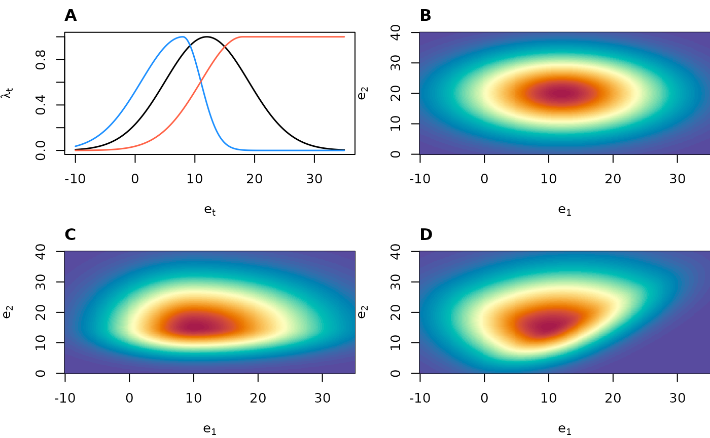

# The xsdm model

**Abstract.** This document is the intended point of entry for the
statistically and computationally sophisticated researcher to begin
using the xsdm package. We state the scientific purpose of the xsdm
approach. We then introduce the main statistical models that xsdm is
built on. And we derive the likelihood functions for those models.

## Scientific purpose of xsdm

Ecological niche models (ENMs) and species distribution models (SDMs)
relate environmental conditions (mostly climate) to observation records
of a species, and are widely used to estimate the current and future
geographic distributions of species (Peterson and Soberón 2012).
However, most classic SDM methods examine spatial relationships between
temporally averaged climate variables and species occurrences. An
important limitation of current SDMs is they do not account for
inter-annual climate variability, even though variability is known by
ecological demographers to play a crucial role in population dynamics
and therefore probably also in species geographic distributions (Gardner
et al. 2021; Perez-Navarro et al. 2021; Stewart et al. 2021; Ingenloff
and Peterson 2021; Barve et al. 2014); and theory is well developed
indicating ways in which variability should influence species ranges
(Holt et al. 2022). Additionally, global change is altering patterns of
climate variability, e.g. by modifying the intensity, frequency, and
duration of extreme events such as heat waves and floods (Hirabayashi et
al. 2013; Meehl and Tebaldi 2004), which contribute to variability.
Thus, addressing the shortcomings of current SDMs with respect to
climate variability seems important for better understanding the impacts
of climate change on biodiversity, and is the first main purpose of the
xsdm model. The xsdm package, to which this document is a partial
introduction, is a frequentist implementation of the xsdm modelling
approach.

To give a sense of how variability must influence species distributions,
we give an idealized but conceptually accurate example. Polar bears’
diets consist largely of ringed and bearded seals, which they attack
from a platform of sea ice. Polar bear populations are thus heavily
dependent on sea ice, especially in spring when mother bears and their
new cubs emerge from hibernation. Because of this dependence, it is easy
to imagine that a polar bear population in a location for which spring
temperatures are -5°C every year may be much more likely to persist than
a population in a location for which spring temperatures are -15°C in
half the years and 5°C in the other half of the years, even though both
locations have the same average spring temperature. Reference (Berti et
al. 2025) makes this intuition somewhat more formal with a modelling
example (their Fig. 1) prior to formally developing the statistics
behind (an earlier version of) the xsdm model.

The second main goal of the xsdm approach is to help incorporate
population dynamic processes into SDMs. Although it is population
dynamics that mediates the relationship between environmental
fluctuations and whether a population of a given species can persist in
a location, traditional SDMs mostly ignore populations dynamics. Several
important studies have advocated for population-process-explicit SDMs,
and have helped inspire our work (Nadeau et al. 2017; Holt 2009; Evans
et al. 2016; Normand et al. 2014; Pagel and Schurr 2012; Ehrlén and
Morris 2015; Briscoe et al. 2019). The xsdm approach builds on those
earlier efforts, in part by emphasizing a computationally tractable
approach that can be practically applied to commonly available data.

## The xsdm model

### Overview of model structure

We assume a population, \\p_t\\, of a species in a location follows the
model \\p\_{t+1} = \lambda_t p_t\\, where \\\lambda_t\\ is the annual
net population growth rate. Given an environmental time series
\\\vec{e}\_t\\ for the location, the model estimates the habitat
suitability of the location for the species in three steps. First, a
“growth-environment function” model component postulates that
\\\lambda_t\\ is a function of \\\vec{e}\_t\\ and a first set of model
parameters, \\\theta_1\\. Second, the long-term stochastic growth rate
(ltsgr) for the location is computed as

\\ \ltsgr = \mean{\log(\lambda_t)}, \\

where the overbar represents the average through time. All logarithms in
xsdm documentation are natural logarithms. The ltsgr is a fundamental
concept of stochastic demography (Caswell 2000; Morris and Doak 2002;
Lande et al. 2003; Tuljapurkar 1990) which characterizes an average rate
at which a population grows from low density in a stochastic
environment. Third, the habitat suitability of the location is assumed
to be a sigmoid function of the ltsgr, with the specific shape of the
sigmoid controlled by a second set of model parameters, \\\theta_2\\.
This component of the model is called the “detection link”. For model
confrontation with species occurrence data and (pseudo-)absences,
habitat suitability is assumed to represent a probability of
occurrence/detection in a location to which the species could have
access (i.e., it is geographically accessible). Details of the model are
presented below. See also (Berti et al. 2025) for additional details
(though that publication uses a different growth-environment function
and a Bayesian approach). We recognize that the xsdm model is an
idealization, and many complexities can be added in future work which
may or may not statistically improve the degree to which the model
describes data. The model described here is a starting point.

### The growth-environment function

Let \\n\\ be a positive integer representing the number of environmental
variables which will influence population growth in our model, i.e.,
\\n\\ is the dimension of \\\vec{e}\_t\\. Let
\\\vec{\mu}=(\mu_1,\ldots,\mu_n)\\ be an \\n\\-vector of unconstrained
real values representing the optimal values for growth of each
environmental variable. Let
\\\vec{\sigma}\_L=(\sigma\_{L,1},\ldots,\sigma\_{L,n})\\ and
\\\vec{\sigma}\_R=(\sigma\_{R,1},\ldots,\sigma\_{R,n})\\ be
\\n\\-vectors of strictly positive real values representing widths of
the growth-environment function to the left and to the right,
respectively, with respect to some axes. Let \\O\\ be an \\n \times n\\
orthogonal matrix (i.e., \\OO^\tau = I\\, where the \\\tau\\ represents
matrix transpose) encoding the axes used. Let \\\lambda\_{\text{max}}\\
represent population growth under optimal conditions, i.e., the maximum
possible annual net growth rate. The growth-environment function is
defined as

\\\begin{equation} \lambda_t = \lambda\_{\text{max}} \prod\_{i=1}^n
\exp\left( -\frac{1}{2} \left( \frac{u\_{t,i}}{\sigma_i(u\_{t,i})}
\right)^2 \right), \label{eq:gefunc} \end{equation}\\

where \\\vec{u}\_t = O^{-1}(\vec{e}\_t-\vec{\mu})\\ and
\\\sigma_i(u\_{t,i}) = \sigma\_{L,i}\\ if \\u\_{t,i} \leq 0\\ and
\\\sigma_i(u\_{t,i}) = \sigma\_{R,i}\\ if \\u\_{t,i} \> 0\\. the figure
below shows examples of functions that can be obtained from
\\\eqref{eq:gefunc}\\ in one and two dimensions.

We now elaborate the reasoning behind \\\eqref{eq:gefunc}\\ and how the
parameters control the shape of the function. In the univariate case
(\\n=1\\), \\\eqref{eq:gefunc}\\ reduces to

\\ \lambda_t= \lambda\_{\text{max}}\exp \left( -\frac{1}{2} \left(
\frac{e_t - \mu}{\sigma(e_t-\mu)} \right) ^2 \right), \\

where \\\sigma(e_t-\mu) = \sigma_L\\ if \\e_t \leq \mu\\, and
\\\sigma(e_t-\mu) = \sigma_R\\ if \\e_t \> \mu\\. This function is
proportional to an asymmetric generalization of the probability density
function (pdf) of a normal distribution. This form is convenient because
annual net growth rate should decline monotonically to zero for extreme
values of \\e_t\\, though it may do so asymmetrically. For similar
reasons, the multivariate growth-environment function is an asymmetric
generalization of a functional form used in the pdf of the multivariate
normal distribution,

\\\begin{equation} \exp\left( -\frac{1}{2}(\vec{e}\_t-\vec{\mu})^\tau
\Sigma^{-1} (\vec{e}\_t-\vec{\mu}) \right), \label{eq:multivarnorm}
\end{equation}\\

where \\\Sigma\\ is a positive-definite covariance matrix. To define an
asymmetric generalization of eq. \\\eqref{eq:multivarnorm}\\, we first
note, by the spectral theorem, that we can write \\\Sigma= O D O^{-1}\\
for \\O\\ an orthogonal matrix and \\D\\ a diagonal matrix with positive
diagonal entries. The columns of \\O\\ are the eigenvectors of
\\\Sigma\\ and the diagonal entries of \\D\\ are the corresponding
eigenvalues. Then,

\\ \begin{aligned} \exp\left(-\frac{1}{2}(\vec{e}\_t - \vec{\mu})^\tau
\Sigma^{-1} (\vec{e}\_t - \vec{\mu})\right) &=
\exp\left(-\frac{1}{2}(\vec{e}\_t - \vec{\mu})^\tau O D^{-1} O^{-1}
(\vec{e}\_t - \vec{\mu})\right) \\ &= \exp\left(-\frac{1}{2}\[O^{-1}
(\vec{e}\_t - \vec{\mu})\]^\tau D^{-1} \[O^{-1} (\vec{e}\_t -
\vec{\mu})\]\right) \\ &= \exp\left(-\frac{1}{2}\vec{u}\_t^\tau D^{-1}
\vec{u}\_t\right), \end{aligned} \\

where \\\vec{u}\_t = O^{-1} (\vec{e}\_t - \vec{\mu})\\. Letting
\\\sigma_i\\ be the square root of the \\i\\th diagonal entry of \\D\\,
this is

\\ \exp\left(-\frac{1}{2}\sum\_{i=1}^n \left( \frac{u\_{t,i}}{\sigma_i}
\right)^2\right)= \prod\_{i=1}^n \exp\left(-\frac{1}{2} \left(
\frac{u\_{t,i}}{\sigma_i} \right)^2\right). \\

Introducing asymmetry, this generalizes straightforwardly to

\\ \prod\_{i=1}^n \exp\left(-\frac{1}{2} \left(
\frac{u\_{t,i}}{\sigma_i(u\_{t,i})} \right)^2\right). \\

where \\\sigma_i(u\_{t,i}) = \sigma\_{L,i}\\ if \\u\_{t,i} \leq 0\\ and
\\\sigma_i(u\_{t,i}) = \sigma\_{R,i}\\ if \\u\_{t,i} \> 0\\. Multiplying
by \\\lambda\_{\text{max}}\\ then gives \\\eqref{eq:gefunc}\\. The
parameters \\\sigma\_{L,i}\\ and \\\sigma\_{R,i}\\ control the width of
the growth environment function in the positive and negative directions
with respect to the \\i\\th element of an orthonormal basis. The matrix
parameter \\O\\ controls the orthonormal basis. One can envision \\O\\
encoding a rigid transformation that transforms the standard coordinate
axes into the orthonormal basis.

**Figure:** Example of growth environment functions, relating
environmental conditions at year \\t\\ and the annual growth rate in
that year, \\\lambda_t\\. **A**) Three uni-dimensional growth
environment functions: symmetric (black), asymmetric (blue), and
saturating (red). **B**) A two-dimensional growth environment function
symmetric with respect to each axis and with zero rotation. **C**) A
two-dimensional growth environment function asymmetric with respect to
each axis and with zero rotation. **D**) A two-dimensional growth
environment function asymmetric with respect to each axis and with
rotation = \\\pi/4\\.

### The detection link

The detection link is

\\ \frac{p_d}{1+\exp(-b(\ltsgr-c))}, \\

where \\0\<p_d \leq 1\\, \\b\>0\\, and \\c\\ is an unconstrained real
number. Thus, the complete list of parameters for xsdm is
\\\lambda\_{\text{max}}\\, \\\vec{\mu}\\, \\\vec{\sigma}\_L\\,
\\\vec{\sigma}\_R\\, \\O\\, \\p_d\\, \\b\\, and \\c\\, though the model
as presented so far is over-parameterized (structurally
non-identifiable), as we describe in the next section.

## The likelihood function

The long-term stochastic growth rate (ltsgr) for a given location is

\\ \begin{aligned} \ltsgr &= \mean{\log(\lambda_t)} \\ &=
\log(\lambda\_{\text{max}}) - \frac{1}{2}\sum\_{i=1}^n \mean{\left(
\frac{u\_{t,i}}{\sigma_i(u\_{t,i})} \right)^2}. \end{aligned} \\

Plugging this into the detection link gives a probability of detection
for the location of

\\\begin{align} P(X=1) &= \frac{p_d}{1+\exp\left( -b(\ltsgr-c) \right)}
\notag \\ &= \frac{p_d}{1+\exp\left(\frac{b}{2}\sum\_{i=1}^n
\mean{\left( \frac{u\_{t,i}}{\sigma_i(u\_{t,i})} \right)^2}
+b(c-\log(\lambda\_{\text{max}}))\right)} \notag \\ &=
\frac{p_d}{1+\exp\left(\frac{1}{2}\sum\_{i=1}^n \mean{\left(
\frac{u\_{t,i}}{\sigma_i(u\_{t,i})/\sqrt{b}} \right)^2}
+b(c-\log(\lambda\_{\text{max}}))\right)} \label{eq:structnonident}\\ &=
\frac{p_d}{1+\exp\left(\frac{1}{2}\sum\_{i=1}^n \mean{\left(
\frac{u\_{t,i}}{\tilde{\sigma}\_i(u\_{t,i})} \right)^2}
+\tilde{c}\right)},\label{eq:probdetect} \end{align}\\

where \\\tilde{c} = b(c-\log(\lambda\_{\text{max}}))\\ and
\\\tilde{\sigma}\_i(u\_{t,i}) = \tilde{\sigma}\_{L,i} \equiv
\sigma\_{L,i}/\sqrt{b}\\ for \\u\_{t,i} \leq 0\\ and
\\\tilde{\sigma}\_i(u\_{t,i}) = \tilde{\sigma}\_{R,i} \equiv
\sigma\_{R,i}/\sqrt{b}\\ for \\u\_{t,i} \> 0\\. This parameter reduction
is to eliminate the structural non-identifiability in the model, visible
in \\\eqref{eq:structnonident}\\.

As a result of the parameter reduction, the probability of detection
(and, subsequently, the likelihood, defined below) is a function of
\\\vec{e}\_t\\, \\\vec{\mu}\\, \\O\\, \\\tilde{\vec{\sigma}}\_L\\,
\\\tilde{\vec{\sigma}}\_R\\, \\\tilde{c}\\, and \\p_d\\. If \\P_i\\ is
the probability of detection, just defined, for location \\i\\, then the
likelihood is \\\prod_i P_i \prod_j (1-P_j)\\, where the first product
is over all detection locations and the second is over all locations of
absence or pseudo-absence.

## Interpretation of parameters

The `xsdm` package facilitates inferences of the parameters
\\\vec{\mu}\\, \\O\\, \\\tilde{\vec{\sigma}}\_L\\,
\\\tilde{\vec{\sigma}}\_R\\, \\\tilde{c}\\, and \\p_d\\ and of
quantities which can be derived from these parameters. But what does an
inference about these parameters imply about the structure of the
original growth-environment function?

The log growth-environment function is

\\ \log(\lambda_t) = \log(\lambda\_{\text{max}}) -
\frac{1}{2}\sum\_{i=1}^n \left( \frac{u\_{t,i}}{\sigma_i(u\_{t,i})}
\right)^2, \\

where \\\vec{u}\_t = O^{-1}(\vec{e}\_t-\vec{\mu})\\ and where
\\\sigma_i(u\_{t,i}) = \sigma\_{L,i}\\ if \\u\_{t,i} \leq 0\\ and
\\\sigma_i(u\_{t,i}) = \sigma\_{R,i}\\ if \\u\_{t,i} \> 0\\. But
inference only provides estimates of \\\tilde{\vec{\sigma}}\_L\\ and
\\\tilde{\vec{\sigma}}\_R\\, where \\\tilde{\vec{\sigma}}\_L =
\vec{\sigma}\_L/\sqrt{b}\\ and \\\tilde{\vec{\sigma}}\_R =
\vec{\sigma}\_R/\sqrt{b}\\ and \\b\\ is unknown. So

\\ \log(\lambda_t) = \log(\lambda\_{\text{max}}) -
\frac{1}{2}\sum\_{i=1}^n \left( \frac{u\_{t,i}}{\sqrt{b}
\tilde{\sigma}\_i(u\_{t,i})} \right)^2, \\

where \\\tilde{\sigma}\_i(u\_{t,i}) = \tilde{\sigma}\_{L,i}\\ if
\\u\_{t,i} \leq 0\\ and \\\tilde{\sigma}\_i(u\_{t,i}) =
\tilde{\sigma}\_{R,i}\\ if \\u\_{t,i} \> 0\\. This equals

\\ \log(\lambda_t) = \log(\lambda\_{\text{max}}) -
\frac{1}{2b}\sum\_{i=1}^n \left(
\frac{u\_{t,i}}{\tilde{\sigma}\_i(u\_{t,i})} \right)^2. \\

Defining

\\ f(\vec{e}\_t) = - \sum\_{i=1}^n \left(
\frac{u\_{t,i}}{\tilde{\sigma}\_i(u\_{t,i})} \right)^2, \\

the function \\f\\ is determined by inference, and the
growth-environment function is \\g = af+b\\ for some unknown scalars
\\a\\ and \\b\\ with \\a\>0\\. We plot evenly spaced contours of \\f\\
as a means displaying what can be inferred using the xsdm model about
the nature of the dependence of growth rate on the environment. The
contours of the true growth environment function will be the same as
those of \\f\\, though the levels/labels of those contours will differ
according to the values of \\a\\ and \\b\\. In any case, much of the
interpretive value of the growth-environment function is available
through these contours, since they specify the inferred optimal
environmental conditions for growth, and the relative sensitivities of
growth to various changes in the environment. The indeterminancy of the
growth-environment function essentially springs from the fact that it is
not possible to distinguish a species which is capable of thriving in a
location but is difficult to detect, from a species which is less
capable of thriving but easier to detect.

## What to read next

Next steps may include the “quickstart” in the package readme at
<https://github.com/xsdm-project/xsdm>, or the document “How to fit xsdm
with species occurrence data using xsdml”, which is more thorough and
aimed more at statistically and computationally sophisticated users.

Barve, Narayani, Craig Martin, Nathaniel A Brunsell, and A Townsend
Peterson. 2014. “The Role of Physiological Optima in Shaping the
Geographic Distribution of Spanish Moss.” *Global Ecology and
Biogeography* 23 (6): 633–45.

Berti, E., ALR Fernández, B Rosenbaum, TA Peterson, J Soberón, and DC
Reuman. 2025. “The Impacts of Climate Variability on the Niche Concept
and Distributions of Species.” *bioRxiv*, ahead of print.
<https://doi.org/10.1101/2024.10.30.621023v2>.

Briscoe, N. J., J. Elith, R. Salguero-Gómez, et al. 2019. “Forecasting
Species Range Dynamics with Process-Explicit Models: Matching Methods to
Applications.” *Ecology Letters* 22: 1940–56.

Caswell, Hal. 2000. *Matrix Population Models*. Vol. 1. Sinauer
Sunderland, MA.

Ehrlén, J, and W. F. Morris. 2015. “Predicting Changes in the
Distribution and Abundance of Species Under Environmental Change.”
*Ecology Letters* 18: 303–14.

Evans, M. E. K., C. Merow, S. Record, S. M. McMahon, and B. J. Enquist.
2016. “Toward Process-Based Range Modelling of Many Species.” *Trends in
Ecology and Evolution* 31: 860–71.

Gardner, Alexandra S, Kevin J Gaston, and Ilya MD Maclean. 2021.
“Accounting for Inter-Annual Variability Alters Long-Term Estimates of
Climate Suitability.” *Journal of Biogeography* 48 (8): 1960–71.

Hirabayashi, Yukiko, Roobavannan Mahendran, Sujan Koirala, et al. 2013.
“Global Flood Risk Under Climate Change.” *Nature Climate Change* 3 (9):
816–21.

Holt, RD, M Barfield, and JH Peniston. 2022. “Temporal Variation May
Have Diverse Impacts on Range Limits.” *Phil. Trans. R. Soc. B* 377:
20210016.

Holt, Robert D. 2009. “Bringing the Hutchinsonian Niche into the 21st
Century: Ecological and Evolutionary Perspectives.” *Proceedings of the
National Academy of Sciences* 106 (supplement_2): 19659–65.

Ingenloff, Kate, and Andrew T Peterson. 2021. “Incorporating Time into
the Traditional Correlational Distributional Modelling Framework: A
Proof-of-Concept Using the Wood Thrush Hylocichla Mustelina.” *Methods
in Ecology and Evolution* 12 (2): 311–21.

Lande, R, S Engen, and B-E Saether. 2003. *Stochastic Population
Dynamics in Ecology and Conservation*. Oxford University Press.

Meehl, Gerald A, and Claudia Tebaldi. 2004. “More Intense, More
Frequent, and Longer Lasting Heat Waves in the 21st Century.” *Science*
305 (5686): 994–97.

Morris, W. F, and D. F. Doak. 2002. *Quantitative Conservation Biology:
Theory and Practice of Population Viability Analysis*. Sinauer
Associates, Inc.

Nadeau, Christopher P, Mark C Urban, and Jon R Bridle. 2017. “Coarse
Climate Change Projections for Species Living in a Fine-Scaled World.”
*Global Change Biology* 23 (1): 12–24.

Normand, Signe, Niklaus E Zimmermann, Frank M Schurr, and Heike Lischke.
2014. “Demography as the Basis for Understanding and Predicting Range
Dynamics.” *Ecography* 37 (12): 1149–54.

Pagel, Jörn, and Frank M Schurr. 2012. “Forecasting Species Ranges by
Statistical Estimation of Ecological Niches and Spatial Population
Dynamics.” *Global Ecology and Biogeography* 21 (2): 293–304.

Perez-Navarro, Maria Angeles, Olivier Broennimann, Miguel Angel Esteve,
et al. 2021. “Temporal Variability Is Key to Modelling the Climatic
Niche.” *Diversity and Distributions* 27 (3): 473–84.

Peterson, A Townsend, and Jorge Soberón. 2012. “Species Distribution
Modeling and Ecological Niche Modeling: Getting the Concepts Right.”
*Natureza & Conservação* 10 (2): 102–7.

Stewart, SB, J Elith, M Fedrigo, et al. 2021. “Climate Extreme Variables
Generated Using Monthly Time-Series Data Improve Predicted Distributions
of Plant Species.” *Ecography* 44 (4): 626–39.

Tuljapurkar, S. 1990. *Population Dynamics in Variable Environments*.
Springer-Verlag.
